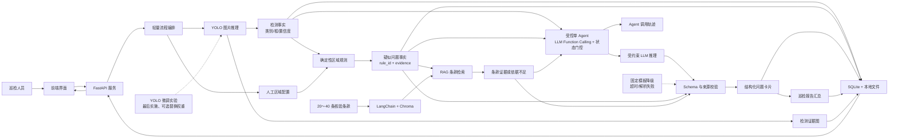
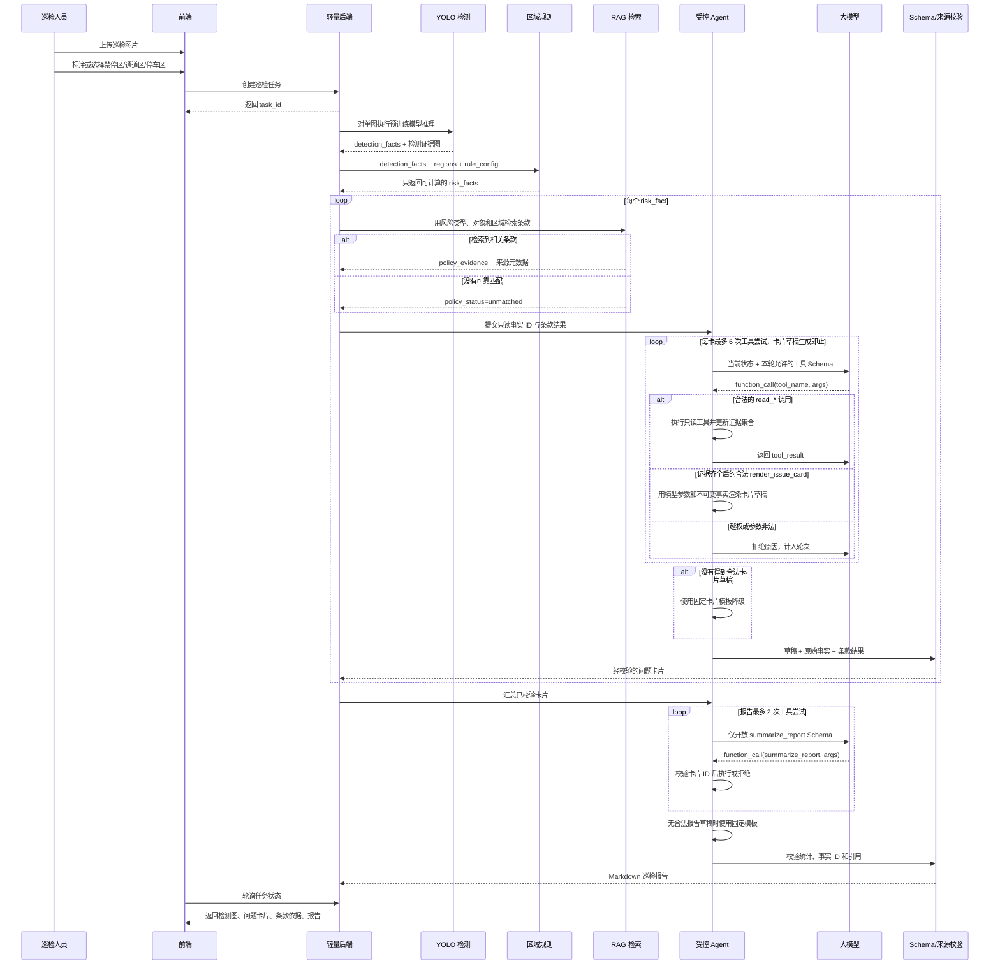
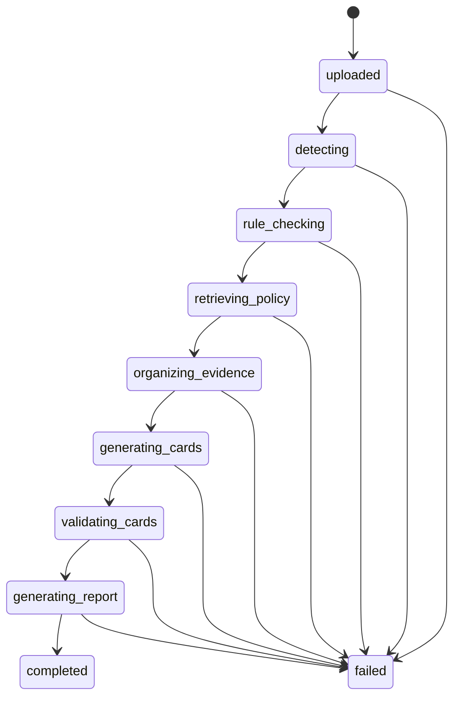
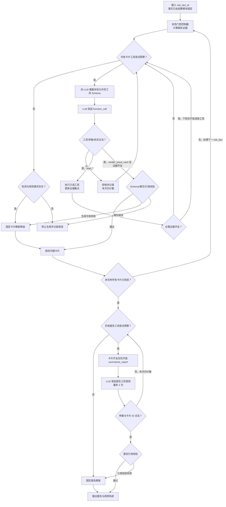
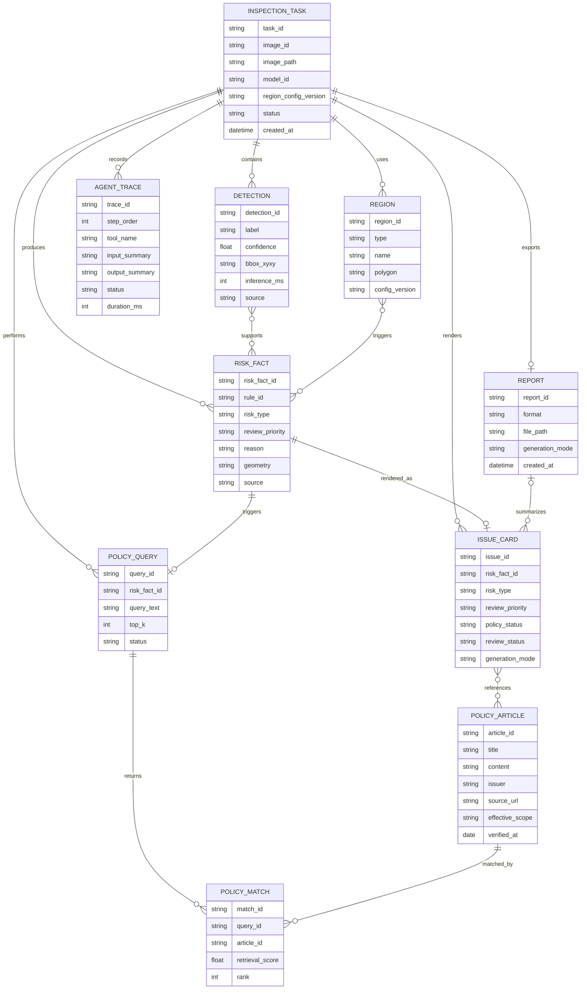
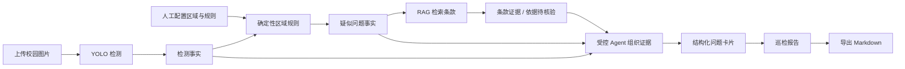

# CampusParkGuard 项目设计方案

## 1. 项目概述

项目名称：**CampusParkGuard：校园停车与通行秩序智能巡检助手**

CampusParkGuard 是一个面向约一个月、两人小组课程设计的轻量应用，不是执法系统、实时监控平台或企业级工单平台。系统面向校园停车区、道路出入口、非机动车停放区、消防通道和教学楼门口等场景，以单张图片为主要输入，完成目标检测、确定性区域规则判断、条款检索、问题卡片和巡检报告生成。

系统输出统一表述为“**疑似问题、待人工复核**”。YOLO 只回答“画面中检测到了什么”，区域规则只回答“目标与人工配置区域满足了什么关系”；只有这两层可以产生风险事实。RAG、Agent 和大语言模型均无权新增、删除或改判风险事实。

### 1.1 输入、输出与主线

核心输入：

- 巡检图片；
- 人工标注或预设的禁停区、停车区、通道区等区域；
- 经人工摘录并核验的停车、非机动车、消防通道和出入口管理条款。

核心输出：

- 检测可视化图片；
- car、bicycle、motorcycle、person 等目标检测结果；
- 带规则编号、检测对象和区域证据的疑似问题事实；
- 带条款编号、来源链接和复核状态的问题卡片；
- Markdown 巡检报告，PDF 作为可选导出格式；
- 受控 Agent 工具调用轨迹。

技术主线：

> 上传校园场景图片 -> YOLO 视觉检测 -> 区域规则判断 -> 形成确定性的疑似问题事实 -> RAG 检索条款 -> 受控 Agent 组织证据 -> 生成问题卡片 -> 汇总巡检报告

YOLO 微调是主流程稳定后最后实施的独立增强实验，不出现在上述闭环的完成条件中。

### 1.2 课程定位与老师建议的落地

四天课程逐字稿给出了视觉算法、大模型应用/RAG、Agent/工作流等可选作业路线，并强调不能把课堂 Demo 原样作为作业。结合本项目周期，形成以下取舍：

| 课程与老师建议 | 本方案中的落实 |
|---|---|
| 课程项目应可运行、可展示，工作量与一个月周期匹配 | 固定单图输入、少量类别、3～5 条规则模板和 20～40 条条款，优先贯通一次完整演示 |
| YOLO 项目的有效工作在数据、训练/验证和结果解释 | MVP 使用预训练模型；小规模数据标注、微调与指标比较放到最后，独立验收 |
| RAG 作业不能照搬基础问答代码，应结合自己的数据扩展 | 自建校园条款库，保留条款元数据、检索结果和引用状态，并接入问题卡片与报告 |
| LangChain 更适合体现编码细节，Dify 更适合快速原型 | 代码版 LangChain 是主实现；Dify 仅作为可选工作流复刻，不成为运行依赖 |
| 本地部署现成大模型本身代码量有限 | 大模型仅作为受约束的文本生成组件，项目贡献重点放在区域规则、数据结构、工具封装、校验和端到端集成 |
| Agent 适合拆解和调用工具，但稳定性不如确定性程序 | 只在证据组织阶段实现单个受控 Function Calling Agent；空间判断由代码执行，工具白名单、状态门控、轮次和输出 Schema 均受限制 |

课程设计完成标准不是“模型一定达到高准确率”，而是能稳定展示输入、各阶段证据、失败分支和最终结果，并能解释哪些内容由模型产生、哪些内容由确定性代码产生。

## 2. 设计原则

1. **先闭环、后增强。** 先用预训练 YOLO 完成可演示闭环；微调、Dify 复刻、第二种 LLM 后端和视频抽帧均在主流程冻结后考虑。
2. **事实来源单一。** 检测事实只能来自 YOLO，疑似问题事实只能来自检测结果与确定性区域规则；LLM 不看图猜测，也不创造风险事实。
3. **依据与事实分离。** RAG 只检索和引用管理条款，不负责判定是否存在问题；无匹配条款时明确输出“依据待人工核验”。
4. **Agent 受控。** LLM 只在当前状态允许的白名单内发起 Function Calling；控制器校验工具、参数、事实 ID 和轮次，不设计开放式自主决策或多 Agent 协作。
5. **范围可完成。** MVP 主做单图，聚焦 COCO 预训练模型常见的 person、bicycle、car、motorcycle；实时视频只作远期方向。
6. **规则少而可解释。** MVP 只实现 3～5 个与已配置区域直接相关的规则，每次命中都保存规则 ID、检测 ID、区域 ID 和计算理由。
7. **课堂 Demo 必须业务化扩展。** 可复用课堂中的推理、RAG 和训练流程，但区域配置、规则引擎、证据结构、卡片 Schema、工具调用和报告整合由项目自行完成。
8. **允许降级但不伪造。** LLM 超时或结构化输出失败时使用固定模板；RAG 无结果时保留事实并标记待核验，任何失败都不能由模型补造内容。
9. **微调接口解耦。** 基线权重和可选微调权重输出相同检测结构；未完成微调或效果未提升都不影响 MVP 完整性。
10. **隐私与用途受限。** 不做人脸识别和人员身份追踪；车牌识别仅可选且默认脱敏；系统仅用于教学演示和辅助复核，不作执法认定。

## 3. 总体架构



架构中的硬边界如下：

- `DETECTION_FACT` 和 `RISK_FACT` 在进入 RAG、Agent、LLM 前已经固定；后续模块只能引用，不能改写。
- 条款证据与疑似问题事实分别存储。检索命中不等于问题成立，检索为空也不撤销已有事实。
- LLM 仅生成建议性文字和摘要；卡片关键字段由程序从事实与条款记录填充并校验。
- YOLO 微调只通过统一模型接口替换权重，不改变区域规则、RAG、Agent 或前端数据格式。

## 4. 核心流程



MVP 可用 FastAPI 后台线程处理单任务；不引入分布式队列。任务状态只服务界面进度和错误定位：



失败状态必须保存 `failed_stage` 和可读错误信息；已产生的检测事实、规则事实或检索结果仍可在前端查看，便于课程答辩时解释降级行为。

## 5. 模块设计

### 5.1 前端界面

职责：

- 图片上传；
- 禁停区、通道区、停车区区域标注或预设选择；
- 任务状态展示；
- 检测框与区域叠加展示；
- 检测事实、规则命中原因和问题卡片分层展示；
- 条款编号、发布单位、原文链接和核验日期展示；
- Agent 调用轨迹的只读展示；
- `待复核 / 确认 / 排除` 三种轻量复核状态修改；
- Markdown 报告预览与导出。

MVP 固定使用 **Streamlit**，避免同时维护 Vue/React。前端只处理演示所需交互，不实现登录、角色权限、派单、消息通知、审批或多部门流转。区域编辑器若工期不足，可先用示例图片的 JSON 预设区域，保证闭环优先。

页面建议按“上传与区域配置—分析过程—问题卡片—报告”四个区域组织，使答辩时能逐层展示证据来源。

### 5.2 后端服务

职责：

- 上传接口；
- 任务创建与状态查询；
- 图片、区域、检测事实、疑似问题事实、条款证据、问题卡片和报告存储；
- 按固定顺序调用 YOLO、区域规则、RAG、受控 Agent 和报告模块；
- 在每一阶段执行输入 Schema 校验、错误记录和幂等保存；
- 通过后台线程执行单机分析任务，前端按 `task_id` 查询状态。

建议实现：

- FastAPI；
- SQLite；
- 本地文件系统；
- 后台线程。

一个月版本不引入 Redis、Celery、对象存储或微服务。若前后端分离影响进度，可把同一组 Python 服务函数直接接入 Streamlit，但模块输入输出 Schema 保持不变。

### 5.3 YOLO 视觉检测模块

目标：从上传图片中产生可复现的对象级检测事实，为区域规则提供唯一视觉输入。该模块直接体现第一天 CNN/PyTorch 基础和第二天目标检测、IoU、NMS 与推理流程。

核心检测对象：

- 机动车：car；
- 非机动车：bicycle、motorcycle；
- 行人：person。

以上类别均属于 COCO 常见类别，可先使用预训练权重形成基线。第二天课堂实战以 YOLOv5 的 `detect/train` 路线为主；工程实现默认在第一周冻结 **YOLOv8n**，以便使用当前 Ultralytics `Results` API，但必须在报告中注明它是外部工程版本，不冒充课堂实战代码。若课程环境已经稳定配置 YOLOv5s，也可在开题时改为冻结 YOLOv5s；一旦确定便只维护该版本，并通过统一适配层输出相同 Schema。

实现步骤：

1. 校验图片格式、大小和方向信息；
2. 使用 PyTorch 后端加载冻结权重并执行单图推理；
3. 读取 NMS 后的类别、`xyxy` 边界框和置信度，只保留四个核心类别；
4. 保存结构化结果、推理耗时与带框证据图；
5. 将结果交给区域规则，YOLO 本身不输出“违停”“占道”等结论。

检测结果示例：

```json
{
  "detection_id": "det_001",
  "task_id": "task_001",
  "label": "car",
  "class_id": 2,
  "confidence": 0.91,
  "bbox_xyxy": [120, 80, 360, 260],
  "model_id": "yolo_baseline_fixed",
  "inference_ms": 48,
  "source": "yolo"
}
```

Ultralytics [Predict 官方文档](https://docs.ultralytics.com/modes/predict/)已提供图片输入、`Results.boxes`、置信度、绘图和保存能力；[COCO 类别配置](https://docs.ultralytics.com/datasets/detect/coco/)可核验上述四类。项目的自写工作集中在结果标准化、区域关联、证据保存和下游闭环，而不是重写检测框架。

### 5.4 YOLO 微调增强模块

微调模块是**最后实施、接口独立、可单独验收**的增强实验，不属于 MVP 必需功能。主系统始终能使用预训练基线完成 `car`、`bicycle`、`motorcycle`、`person` 检测。

定位：

- 只有当单图闭环、演示样例和错误处理已冻结后才开始；
- 训练代码、数据目录和权重目录与应用主代码隔离；
- 无权重、训练失败、指标未提升或时间不足时自动继续使用基线权重；
- 体现数据准备、标注、训练、验证、指标解释和误差分析，不以高准确率作为项目完成前提。

可选微调目标：

- 校园非机动车检测增强；
- 电动车样本增强，可先归入 bicycle/motorcycle；
- 特定校园场景下的车辆检测效果优化。

建议实验流程与工作量：

1. 收集约 100～300 张自建或许可明确的公开图片，删除或脱敏敏感信息；
2. 只标注确有短板的少量类别，检查 YOLO 标签格式和类别映射；
3. 固定 train/val/test 划分、随机种子、基线权重和主要超参数；
4. 使用与主系统相同系列的小型预训练权重进行短轮次训练；
5. 在同一测试集比较基线与微调模型，并保存训练曲线、典型误检和漏检；
6. 仅当新权重可加载且输出 Schema 通过回归测试时，才允许在界面中手动切换。

[Ultralytics Train 官方文档](https://docs.ultralytics.com/modes/train/)支持基于预训练权重和自定义数据集训练。课堂第一天的 `Dataset/DataLoader`、训练/验证、损失与模型保存思路可用于解释实验组织，但检测标签、训练入口和指标以 YOLO 官方流程为准。

微调结果不改变主系统接口，仍输出统一检测结构：

```json
{
  "detection_id": "det_001",
  "task_id": "task_001",
  "label": "motorcycle",
  "class_id": 3,
  "confidence": 0.88,
  "bbox_xyxy": [140, 90, 330, 250],
  "model_id": "yolo_finetuned_optional",
  "inference_ms": 51,
  "source": "yolo"
}
```

评估材料：

- 数据集说明、类别分布和划分；
- Precision、Recall、mAP50、训练/验证损失和推理耗时；
- 基线与微调模型的同图可视化对比；
- 典型误检、漏检及未提升原因分析。

若时间不足，最低交付为：基线测试结果、少量已标注样例、数据 YAML、训练命令/参数设计和预期比较表。此时仍视为增强实验未完成，不影响 MVP 验收。

### 5.5 区域管理模块

目标：用少量人工配置的二维多边形为检测结果补充空间语义。区域是规则输入，不由 LLM 自动猜测。

区域类型：

- `no_parking_zone`：禁停区；
- `parking_zone`：允许停车区；
- `fire_lane`：消防通道；
- `entrance_exit`：楼宇或道路出入口；
- `pedestrian_passage`：人员通道；
- `non_motor_parking_zone`：非机动车停放区。

区域来源：

- 前端手动标注；
- 与示例图片绑定的 JSON 预设；
- 固定机位的区域模板。MVP 不做摄像机标定和跨画面自动迁移。

区域结构示例：

```json
{
  "region_id": "region_001",
  "image_id": "image_001",
  "type": "no_parking_zone",
  "name": "教学楼门口禁停区",
  "polygon": [[50, 100], [600, 100], [600, 260], [50, 260]],
  "config_version": "v1",
  "created_by": "manual"
}
```

区域保存前检查点数、坐标范围和多边形有效性；前端叠加显示区域边界，使人工能确认配置是否准确。

### 5.6 区域规则判断模块

目标：用可重复计算的几何条件，把检测事实转为“疑似问题事实”。规则模块不调用 LLM，也不读取管理条款。

MVP 建议只实现下列 3～5 个模板，最终以演示图片和区域配置能稳定覆盖的规则为准：

| 规则 ID | 输入对象与区域 | 确定性条件 | 输出类型 |
|---|---|---|---|
| `R-NP-01` | car + `no_parking_zone` | 车辆底边中心点在区域内，或检测框与区域重叠比例超过配置阈值 | 机动车进入禁停区 |
| `R-FL-01` | car/bicycle/motorcycle + `fire_lane` | 对象锚点在消防通道内 | 疑似占用消防通道 |
| `R-EX-01` | bicycle/motorcycle + `entrance_exit`/`pedestrian_passage` | 对象锚点在出入口或人员通道内 | 非机动车占用通行区域 |
| `R-NM-01` | bicycle/motorcycle + `non_motor_parking_zone` | 在区域边界已完整配置的演示场景中，对象未落入允许区域 | 非机动车位于指定停放区外；是否处于停放状态需人工复核 |
| `R-MIX-01` | person + car/motorcycle + 通道区 | 两类对象锚点均在同一通道区，图像平面距离小于配置阈值 | 人员与车辆在同一通道内近距离共现；不推断运动行为 |

空间判断优先使用检测框底边中心点，必要时再使用框与多边形重叠比例。阈值写入 `rule_config`，不在代码中散落硬编码。未做透视标定的像素距离只能表示图像平面近距离共现，不能证明移动轨迹或“混行”。`review_priority` 仅由项目内部规则配置，用于课程演示中的人工复核排序，不是法规或学校发布的风险等级。车位占用统计不属于风险事实，可作为扩展统计单独实现。

风险事实示例：

```json
{
  "risk_fact_id": "risk_001",
  "task_id": "task_001",
  "rule_id": "R-NP-01",
  "risk_type": "机动车进入禁停区",
  "review_priority": "normal",
  "priority_source": "course_demo_rule_config",
  "reason": "det_001 的底边中心点位于 region_001 内",
  "detection_ids": ["det_001"],
  "region_ids": ["region_001"],
  "geometry": {"method": "bottom_center_in_polygon", "matched": true},
  "source": "yolo_and_region_rule",
  "review_required": true
}
```

规则输出是可审计计算结果，不附加含义模糊的“综合置信度”。视觉不确定性保留在各 `detection.confidence` 中，几何条件则保存布尔命中值和计算细节。

### 5.7 RAG 制度检索模块

目标：为已经形成的疑似问题事实寻找可追溯的管理依据。RAG 不读取原图、不执行空间判断、不产生风险类型，也不把“召回了一条条款”解释为事实成立。

知识库控制在 **20～40 条**，建议按机动车停放、非机动车停放、消防/疏散通道和校园通行区域组织。资料只从目标学校官网、保卫处和政府公开页面人工摘录；演示库若引用其他学校规定，必须标记为“示例条款”，不能冒充本校制度。不同校区和时期规定可能变化，因此每条都保存适用范围与核验日期。

条款级结构：

```json
{
  "article_id": "PARK-001",
  "title": "消防通道禁止占用",
  "content": "任何车辆不得占用、堵塞、封闭消防通道，应保持消防通道畅通。",
  "risk_types": ["疑似占用消防通道"],
  "object_types": ["car", "bicycle", "motorcycle"],
  "region_types": ["fire_lane"],
  "issuer": "示例发布单位",
  "source_title": "示例校园消防通道管理规定",
  "source_url": "https://example.edu/policy/park-001",
  "effective_scope": "示例条款，正式演示前复核",
  "verified_at": "2026-07-13"
}
```

标准链路与课堂 LangChain 代码对应：

1. **加载与规范化**：读取轻量 JSON/Markdown 条款库，检查必填元数据；
2. **切分**：优先一条规则一个文档；较长原文再用 `RecursiveCharacterTextSplitter` 切分，所有分块继承条款编号和来源；
3. **Embedding 与入库**：使用同一个嵌入模型建立本地 Chroma 持久化索引；
4. **检索**：以 `risk_type + object_type + region_type + rule_reason` 形成查询，先按元数据缩小范围，再取 Top-k 相似条款；
5. **返回**：每次检索都保存 `POLICY_QUERY`；仅对真实命中的条款保存 `POLICY_MATCH`，无命中时查询状态为 `unmatched` 且匹配记录为零；
6. **引用**：输出条款编号、正文、发布单位、原文 URL、核验日期和检索分数；
7. **生成**：只把上述结果作为 LLM 的引用上下文，不允许生成阶段补充库外条款。

MVP 不引入分布式向量库、复杂 Rerank 或语义知识图谱。若基础向量召回对短条款不稳定，可增加按 `risk_type/article_id` 的关键词精确召回并去重，但必须保留原始来源。

约束：

- 问题卡片和报告中的制度依据只能来自本次检索结果；
- 无可靠匹配时设置 `policy_status = unmatched` 并显示“依据待人工核验”；
- 不生成处罚金额、法律责任或执法结论；
- 只有能映射到“可检测对象 + 已配置区域”的条款参与自动匹配，其他条款仅供人工查询；
- 建库后先独立测试分块、Top-k 相关性和来源完整性，再接入 LLM。

[LangChain 官方 RAG 教程](https://docs.langchain.com/oss/python/langchain/rag)给出了“加载—切分—Embedding—向量库—检索—生成”的标准链路。Dify 的知识库与检索测试思想可用于对照验证，但 Dify 不作为 MVP 依赖。

### 5.8 Agent 编排与校验模块

系统外层仍是稳定的“检测 → 规则 → 首次检索”工作流；只有证据组织与成果生成阶段采用单个、受控的 **LLM Function Calling Agent**。模型会根据当前缺失的证据，在本轮允许的工具集合中选择工具并给出参数，因此不是把固定函数流水线误称为 Agent；但它也不是可以自由联网、执行代码或改判事实的自治系统。

可调用工具：

- `read_detection_evidence(detection_ids)`：只读检测类别、框、置信度和证据图路径；
- `read_rule_fact(risk_fact_id)`：只读规则编号、区域关系和疑似问题事实；
- `read_policy_evidence(risk_fact_id)`：只读本次 RAG 结果或 `unmatched` 状态；
- `render_issue_card(risk_fact_id, suggestion_text)`：模型只提供建议性文字参数，工具用程序保存的不可变事实和条款结果填充卡片；
- `summarize_report(issue_card_ids, narrative_summary)`：模型只提供叙述性摘要参数，工具用已校验卡片和程序统计渲染报告。

约束：

- 工具名、参数类型和返回类型预先注册，禁止任意文件、代码、数据库写入和网络搜索工具；
- 每轮只把当前状态允许的工具 Schema 交给 LLM；三个 `read_*` 工具可由模型选择先后，但每项只允许读取当前任务授权的 ID；
- 检测、规则和条款证据未齐全时不开放 `render_issue_card`，所有卡片未校验时不开放 `summarize_report`；
- 每张卡片最多 6 次工具尝试，三个读取工具、最终 `render_issue_card`、非法调用和重试全部计数；没有合法渲染调用时，仅在检测与规则事实完整时使用固定模板，否则停止且不生成问题结论；报告另设最多 2 次 `summarize_report` 尝试；
- `risk_type`、`review_priority`、`rule_id`、检测 ID、区域 ID 和条款引用由程序直接填充，LLM 不得覆盖；
- 生成结果必须通过 JSON Schema、事实 ID 存在性和条款引用白名单校验；
- 检测或规则事实缺失时不生成问题结论；条款缺失时可生成卡片，但必须标记“依据待人工核验”；
- LLM 只负责建议性表述和报告摘要，失败时回退固定模板。

Agent 流程：



Agent 输出应包含：

- 有序工具名、参数摘要、返回状态和耗时；
- LLM 提议的 Function Call、控制器接受/拒绝结果及轮次；
- 问题卡片；
- 引用条款或依据不足状态；
- 校验/降级记录；
- 巡检报告。

Dify 的工作流和 Function Calling Agent 文档可作为“节点输入输出、条件分支、参数 Schema、最大迭代数”的设计参考，但代码版“状态门控控制器 + LLM Function Calling”是唯一 MVP 实现。

### 5.9 问题卡片与轻量复核模块

每个 `risk_fact` 最多生成一张问题卡片。卡片是视觉证据、规则事实、条款依据和报告输入的展示载体，不是真实工单；复核状态只在当前课程演示任务内更新。

问题卡片字段：

```json
{
  "issue_id": "issue_001",
  "task_id": "task_001",
  "risk_fact_id": "risk_001",
  "risk_type": "机动车进入禁停区",
  "review_priority": "normal",
  "rule_id": "R-NP-01",
  "detection_ids": ["det_001"],
  "region_ids": ["region_001"],
  "rule_reason": "det_001 的底边中心点位于 region_001 内",
  "evidence_image_path": "outputs/task_001/annotated.jpg",
  "policy_refs": ["PARK-002"],
  "policy_status": "matched",
  "suggestion": "建议人工核验现场情况，并保持教学楼门口通道畅通。",
  "review_status": "pending",
  "generation_mode": "llm_validated"
}
```

轻量复核只包含以下三种状态：

- `pending`：待人工复核；
- `confirmed`：人工确认该疑似问题；
- `dismissed`：人工排除，并可填写简短原因。

复核操作不得反向修改原始检测、规则或条款记录。项目不增加负责人、截止日期、审批、派单、通知、处置跟踪等企业工单字段；整改前后图片对比仅作为独立扩展。

### 5.10 报告生成模块

报告由已校验的问题卡片和任务统计汇总，LLM 只润色叙述性段落。对象数量、问题数量、风险类型、复核状态和条款引用均由程序计算或复制，不让 LLM 自行统计。

报告内容：

- 巡检地点或场景；
- 图片、模型与区域配置版本；
- 检测对象统计；
- 疑似问题卡片汇总及规则证据；
- 条款依据或“依据待人工核验”；
- 建议性处理提示；
- 人工复核提示；
- Agent 调用与降级摘要；
- 隐私说明。

导出格式：

- Markdown：MVP 必做，使用固定模板保证无 LLM 时仍可导出；
- PDF：增强项，可由浏览器打印或 Pandoc 从同一 Markdown 生成，不维护第二套内容模板。

报告中的每个疑似问题必须能回链到 `risk_fact_id`，每个条款编号必须存在于本次 RAG 返回集合。没有问题时生成“本次样例未命中已配置规则”，而不是输出“现场绝对安全”。

### 5.11 LLM 推理与结构化生成模块

目标：体现第三天本地/接口推理、Prompt 和解码参数，同时把模型能力限制在文字组织范围内。

实现约束：

- 封装统一 `generate_structured(prompt, schema)` 接口，MVP 只选择一种实际后端；
- 默认优先复用课堂可运行的小参数本地 Qwen + Hugging Face `pipeline` 路线，兼容 API 作为配置化替代，不同时维护多套后端；
- 输入只包含检测事实、规则事实和本次检索条款的结构化摘要，不把原图交给多模态模型判定；
- 使用低随机性、受限输出长度、固定系统提示和 JSON Schema；
- 设置超时、一次有限重试和模板降级，记录模型 ID、主要生成参数与 `generation_mode`；
- 密钥、模型路径和服务地址只从环境变量或配置读取，不写入代码与报告；
- 不展示或依赖模型内部思维过程，只保存最终结构化结果和必要调用元数据。

课堂提供的 `hf-pipeline.py`、`hf-qwen.py`、`modelscope-qwen.py` 可作为互斥的调用入口参考；项目只选一条稳定路径。课堂 LCEL 的 `Prompt + LLM + Parser` 组合可复用于卡片和报告生成，但开放式聊天历史、高随机性和纯字符串解析不直接复用。

## 6. 数据关系



关键数据权限矩阵：

| 数据层 | 产生者 | 后续模块权限 | 必须可追溯到 |
|---|---|---|---|
| 检测事实 `DETECTION` | YOLO | 只读 | 原图、模型 ID、阈值和检测框 |
| 疑似问题事实 `RISK_FACT` | 确定性区域规则 | 只读 | 规则 ID、检测 ID、区域 ID 和几何计算 |
| 条款查询/匹配 `POLICY_QUERY` / `POLICY_MATCH` | RAG | 查询可标记 `unmatched`；匹配记录只代表真实条款 | 风险事实、查询参数、条款 ID、来源 URL、核验日期和检索分数 |
| 问题卡片 `ISSUE_CARD` | Agent + Schema 校验器 | 只允许人工修改复核状态 | 唯一 `risk_fact_id`、本次查询状态与真实匹配集合 |
| 巡检报告 `REPORT` | 程序汇总 + LLM/模板 | 不反向修改卡片 | 本次任务的已校验卡片集合 |

MVP 不建立用户、部门、工单、审批、通知或处置流转表。整改前后对比若作为扩展实现，使用独立记录关联问题卡片，不改变上述核心关系。

## 7. 推荐技术栈

为减少环境和双套实现成本，MVP 对每项能力只固定一条主路线：

| 层次 | MVP 选择 | 说明 |
|---|---|---|
| 语言与服务 | Python + FastAPI | 单体后端、后台线程，不拆微服务 |
| 前端 | Streamlit | 直接服务课程演示，不同时开发 Vue/React |
| 视觉 | 默认冻结 YOLOv8n + OpenCV；已有稳定课堂环境时可在开题时改选 YOLOv5s | 只维护一个版本；明确区分课堂 YOLOv5 路线与外部工程版本 |
| 几何规则 | OpenCV；多边形需求增加时选用 Shapely | 保持确定性，3～5 个规则模板 |
| RAG | LangChain + 本地 Embedding + Chroma | 20～40 条条款，不使用分布式向量库 |
| Agent | 状态门控的 LLM Function Calling + Python 控制器 | 模型在当前允许集合内选择工具；控制器拒绝越权并限制轮次 |
| LLM | 小参数本地 Qwen + Hugging Face pipeline | 兼容 API 仅为可替换后端；固定模板负责运行时降级 |
| 存储 | SQLite + 本地文件系统 | 数据、证据图、报告和调用轨迹均本地保存 |
| 报告 | Markdown 模板 | PDF 由同一 Markdown 可选转换 |
| 测试 | pytest + 固定验收图片/查询集 | 覆盖 Schema、几何边界、引用完整性和端到端回归 |

### 7.1 课堂代码的复用边界

- 第二天虽未提供独立代码包，但课件与逐字稿中的 Ultralytics 图片推理、数据 YAML、训练和指标流程可直接指导 YOLO 模块。
- 第三天的 Hugging Face pipeline、Qwen 直接加载和 ModelScope 是互斥后端参考，MVP 只选一种，不复制硬编码路径和超长生成参数。
- 第四天代码可复用 Loader、Splitter、Embedding、Chroma、Retriever 与 `Prompt + LLM + Parser` 的组合方式，但需换成自己的条款、元数据和固定 Schema。
- 课堂代码没有区域几何规则，也没有真正的白名单工具 Agent；这两部分是项目必须自行实现和重点展示的代码贡献。
- 感知器、异或 MLP、LeNet、表情分类模型和完整 PyQt 界面只用于理解课堂原理，不接入项目以制造无关代码量。

## 8. 范围边界

| 层级 | 功能边界 |
|---|---|
| **MVP** | 单张图片；四类 COCO 对象；人工/预设区域；3～5 个确定性规则；20～40 条可追溯条款；单个受控 Agent；结构化问题卡片；三态轻量复核；Markdown 报告与工具轨迹 |
| **最后实施的独立增强** | 小规模 YOLO 数据准备、标注、训练、验证及基线对比；未完成或未提升均回退基线 |
| **其他可选增强** | PDF 导出、整改前后图片对比、车位占用统计、Dify 最小工作流复刻、第二种 LLM 后端、视频抽帧、脱敏车牌识别 |
| **明确不采用** | 实时多路视频平台、跨摄像头跟踪、3D 空间理解、人脸识别、身份追踪、开放式多 Agent、企业工单、审批派单、多用户权限、大规模训练平台和生产级部署 |

系统不声称百分百识别准确，也不输出执法认定。车位占用属于统计，不与风险事实混合；视频只能以人工选取或固定间隔抽帧的方式作为后续扩展；车牌识别默认关闭，即使演示也必须脱敏且不得关联个人身份。

隐私边界：

- 不识别人脸；
- 不保存人员身份；
- 原图、证据图和报告仅在本地课程环境保存，并提供手动清理方式；
- 车牌展示默认脱敏，公开答辩材料优先使用授权或自制样例图；
- 报告只记录对象、区域和疑似问题，不记录个人身份。

## 9. 最小可交付版本 MVP

### 9.1 必须形成的完整闭环

一个月 MVP 必须完成以下九项，顺序不可用 LLM 跳过：

1. 上传一张校园场景图片，并选择或配置区域；
2. 使用冻结的 YOLO 预训练权重检测 `car`、`bicycle`、`motorcycle`、`person`；
3. 保存类别、检测框、置信度、模型 ID、耗时和证据图；
4. 将检测结果与人工区域、规则配置结合；
5. 由确定性代码形成带来源链的疑似问题事实；
6. 用该事实检索条款，返回可引用依据或明确的未匹配状态；
7. 由受控 Agent 调用白名单工具读取并组织证据；
8. 生成结构化问题卡片，允许 `待复核 / 确认 / 排除`；
9. 汇总生成并导出 Markdown 巡检报告，同时保留 Agent 轨迹。

MVP 主流程：



### 9.2 MVP 完整性判定

- 至少选定一种 Qwen/兼容模型后端成功完成一次结构化生成；运行时不可用时，固定模板仍能导出事实、条款和报告。
- 检索不到条款时，问题卡片仍可基于规则事实生成，但必须显示“依据待人工核验”，不得补造引用。
- 没有规则命中时，系统输出检测统计和“未命中已配置规则”，不得把它改写为“现场绝对安全”。
- 每张卡片必须能回溯至一个 `risk_fact_id`；每个 `risk_fact` 必须能回溯至检测 ID、区域 ID 和规则 ID。
- 问题卡片不包含派单、审批、责任人或处置闭环；PDF、整改对比和视频抽帧均不属于 MVP。

### 9.3 与 YOLO 微调的解耦

MVP **不读取、等待或假定存在微调权重**。模型适配层默认加载基线权重；可选权重只有在文件存在、推理成功且 Schema 回归测试通过时才允许手动启用。即使没有收集训练数据、训练失败或指标没有提升，上述九步闭环仍须完整运行。

## 10. 课程技术点对应关系

课程技术不是并列堆叠，而是服务同一个数据流。MVP 覆盖四天课程的主要应用技术；训练成本高、功能重复或与主线无关的内容明确放到增强或不采用。

| 课程日 | 课程技术点 | CampusParkGuard 中的体现 | 层级 | 可用于报告/答辩的证据 |
|---|---|---|---|---|
| 第 1 天 | 深度学习、CNN、前向传播 | 解释 YOLO 的卷积特征提取、预训练迁移和图像张量处理 | MVP | 模型结构说明、输入预处理和推理数据流 |
| 第 1 天 | PyTorch 推理流程 | device、权重加载、推理模式、无梯度前向和结果转结构化数据 | MVP | 运行配置、推理日志和检测 JSON |
| 第 1 天 | Dataset/DataLoader、损失、反向传播、优化器、训练/验证 | 随 YOLO 小样本微调体现，不另起从零 CNN 任务 | 增强 | 数据划分、训练曲线、权重和验证结果 |
| 第 2 天 | YOLO 目标检测 | 用课堂 YOLOv5 概念和 train/detect 流程解释实现；工程端冻结一个小型版本检测四类对象 | MVP | 版本说明、检测框、类别、置信度、耗时和证据图 |
| 第 2 天 | YOLO 推理与微调 | 预训练图片推理进入 MVP；自定义数据训练和 mAP 比较最后实施 | MVP + 增强 | 基线结果；可选 Precision/Recall/mAP 对比 |
| 第 3 天 | 大语言模型推理、Prompt、解码参数 | 把只读事实与条款组织为固定 Schema 的卡片和报告，设置低随机性和降级 | MVP | Prompt 模板、模型配置、校验前后输出 |
| 第 3 天 | Qwen / Hugging Face / ModelScope / API 调用 | 从课堂路径中选择一个后端封装统一接口，另一种仅作替换方案 | MVP | 一次成功调用、超时处理和模板降级演示 |
| 第 4 天 | RAG | 完成条款加载、切分、Embedding、向量库、Top-k 检索、引用和生成 | MVP | 条款元数据、Chroma 索引、查询与召回结果 |
| 第 4 天 | LangChain / LCEL | 用 Loader、Splitter、Retriever、Prompt、LLM、Parser 组件化实现 | MVP | 各组件输入输出和独立检索测试 |
| 第 4 天 | Dify / 工作流 | 借鉴节点、条件分支和结构化输出；可选复刻最小流程 | 增强 | 可选 DSL/截图，不作为代码版依赖 |
| 第 4 天 | Agent / 工具调用 | LLM 在状态门控下调用五个白名单工具，控制器校验参数、授权 ID、轮次和前置证据 | MVP | Function Call 提议、接受/拒绝 trace、失败分支和 Schema 校验 |

不采用从零训练 CNN、LLM 微调、MoE 训练、复杂多 Agent、长期记忆和开放式联网搜索。这样既覆盖课程主干，也不会为了形式完整牺牲一个月可完成性。

## 11. 一个月实施计划

默认按两人小组安排，以每周都有可运行增量为原则：

| 时间 | 必须完成 | 阶段验收 |
|---|---|---|
| 第 1 周 | 冻结范围与 Schema；准备授权样例图和区域 JSON；跑通固定 YOLO 权重；保存检测 JSON 和证据图 | 一张图可稳定得到结构化检测结果，模型版本与阈值可复现 |
| 第 2 周 | 实现 3～5 个区域规则；整理并核验 20～40 条条款；完成 LangChain/Chroma 离线建库与检索测试 | 规则命中可解释；查询能返回条款编号、来源或未匹配状态 |
| 第 3 周 | 实现受控 Agent、LLM 适配器、Schema 校验、问题卡片、Markdown 报告、SQLite 和 Streamlit | 端到端闭环首次跑通；LLM/RAG 失败有明确降级 |
| 第 4 周前半 | 联调、固定验收集、修复边界问题、整理报告与答辩演示 | MVP 冻结，所有核心不变量通过检查 |
| 第 4 周后半 | **仅在 MVP 已冻结后**限时进行 YOLO 微调或补齐微调实验设计；其余时间用于回归测试 | 有实验则展示基线对比；无实验仍以完整 MVP 交付 |

建议分工：成员 A 主责 YOLO、区域配置、规则与视觉测试；成员 B 主责条款库、RAG、LLM、Agent、卡片与报告；两人共同定义 Schema、联调前端、准备验收样例和答辩。各模块均通过文件/函数接口连接，避免某一成员的增强实验阻塞另一成员。

## 12. 测试与验收

### 12.1 模块级检查

| 模块 | 最小测试 | 通过条件 |
|---|---|---|
| YOLO | 固定清晰样例、无目标样例、错误格式图片 | 输出符合 Schema；无目标时返回空列表；错误输入可读失败；保存模型 ID 与阈值 |
| 区域规则 | 点在区域内/外/边界、低置信度过滤、多对象组合 | 同一输入得到同一结果；每个命中均有规则、检测、区域和几何理由 |
| RAG | 为核心风险类型准备约 8～12 个固定查询及预期条款 | Top-k 可人工核对；返回完整来源；无匹配时不生成虚构引用 |
| LLM/卡片 | 正常响应、非法 JSON、超时、缺字段 | 关键事实字段不可改写；Schema 失败能有限重试或模板降级 |
| Agent | 合法 Function Call、非法工具名/参数、重复读取、事实缺失、条款未匹配 | 模型只能看到当前允许工具；控制器拒绝越权并限制轮次；事实缺失停止，条款缺失标记待核验 |
| 报告 | 无问题、单问题、多问题、含排除卡片 | 统计由程序计算；每项可回链；Markdown 始终可导出 |

### 12.2 端到端验收集

- 准备不少于 12 张固定图片，覆盖正常场景、禁停区、消防通道、非机动车通行区和至少一个无目标/无规则命中场景；这只是课程验收集，不宣称代表真实部署精度。
- 100% 问题卡片必须引用现存 `risk_fact_id`，100% 风险事实必须注明 `source = yolo_and_region_rule`。
- 100% 条款引用必须来自本次 `POLICY_MATCH`；没有匹配记录时只能依据 `POLICY_QUERY.status = unmatched` 显示待核验。
- 对相同输入重复运行，规则事实与程序统计必须一致；LLM 的措辞可变化，但不能改变关键字段。
- 至少演示一次 LLM 失败和一次 RAG 无匹配的降级路径，证明系统不会补造事实或依据。

MVP 不设置不现实的“必须达到某个 mAP 才算完成”。基线检测记录定性案例和现有指标；微调的 Precision、Recall、mAP50 与耗时比较在独立实验中验收。

## 13. 可扩展方向

以下项目都以 MVP 已冻结为前提，按时间选择，不同时展开：

1. **YOLO 小样本微调与基线对比**：课程月内最后实施的首选增强；接口不变，允许仅交付实验设计。
2. **Dify 最小工作流复刻**：用相同结构化输入演示知识检索、条件分支和输出，不替代 LangChain 主实现。
3. **第二种 LLM 后端**：在本地 Qwen 与兼容 API 间增加可配置切换，不改变 Prompt 和 Schema。
4. **PDF 导出**：从同一 Markdown 转换，避免双模板内容不一致。
5. **整改前后图片对比**：只做两张图片的检测/规则结果并列，不建设处置流程。
6. **停车位占用统计**：复用 JSON 多边形与点在多边形内判断，作为统计页而非风险结论。
7. **视频抽帧**：只接受文件后按固定间隔选帧，不做实时流、跟踪或跨帧身份关联。
8. **车牌识别**：仅在有授权样例时可选展示，默认关闭且输出必须脱敏；不关联个人信息。

## 14. 答辩亮点

- **闭环完整且范围克制**：一张图片贯通视觉、确定性规则、RAG、受控 Agent、问题卡片和报告，同时明确不是企业平台。
- **事实边界可证明**：YOLO、规则、条款和生成内容分层存储；可以现场从卡片反查规则 ID、检测框和区域。
- **课程技术自然串联**：四天课程内容进入同一数据流，课堂代码被业务化扩展而非直接照搬。
- **视觉演示直观**：原图、检测框、置信度、区域多边形和命中理由可叠加展示。
- **RAG 引用可追溯**：展示分块、Top-k、条款编号、发布单位、链接和未匹配分支，不让模型编造制度。
- **Agent 可控而非玄学**：展示 LLM Function Call、白名单、状态门控、接受/拒绝轨迹、Schema 校验和失败降级。
- **微调取舍合理**：先展示可用基线，再展示小样本训练流程或实验设计；无微调也能完整验收。
- **可测试、可复现**：固定模型/阈值、区域版本、验收图片和查询集，报告统计由程序生成。
- **隐私与用途清晰**：不做人脸识别，车牌扩展脱敏，输出统一为疑似问题和人工复核提示。

## 15. 外部依据与适用限制

| 依据 | 用于支持的设计判断 |
|---|---|
| [Ultralytics Predict](https://docs.ultralytics.com/modes/predict/) / [Train](https://docs.ultralytics.com/modes/train/) | 单图可读取框、类别、置信度和证据图；自定义数据微调可独立开展 |
| [Ultralytics COCO 数据说明](https://docs.ultralytics.com/datasets/detect/coco/) | person、bicycle、car、motorcycle 可作为预训练基线类别 |
| [LangChain RAG 官方教程](https://docs.langchain.com/oss/python/langchain/rag) | 加载、切分、Embedding、向量库、检索、生成的标准链路 |
| [Dify Knowledge](https://docs.dify.ai/en/cloud/use-dify/knowledge/readme) / [Workflow](https://docs.dify.ai/en/quick-start) / [Agent Strategy](https://docs.dify.ai/en/develop-plugin/dev-guides-and-walkthroughs/agent-strategy-plugin) | 只借鉴知识库测试、节点编排、参数 Schema 和最大迭代思想 |
| [Qwen3 Quickstart](https://github.com/QwenLM/Qwen3/blob/main/docs/source/getting_started/quickstart.md) / [Hugging Face Pipeline](https://huggingface.co/docs/transformers/main_classes/pipelines) | 本地或兼容服务推理及统一适配层的可行性 |
| [上海交通大学机动车管理办法](https://bwc.sjtu.edu.cn/note/385) / [海南大学校园交通安全管理通知](https://security.hainanu.edu.cn/info/1023/2577.htm) | 校园禁停、通道、出入口和分区停放场景的条款字段与区域类型参考 |
| [应急管理部电动车停放充电通告](https://www.mem.gov.cn/gk/tzgg/qt/201712/t20171231_397854.shtml) | 消防、疏散通道相关条款边界；不能从单图推断充电状态或法律责任 |
| [Ultralytics Parking Management](https://docs.ultralytics.com/reference/solutions/parking_management) | JSON 区域与检测框空间关系的轻量组织方式，仅作规则实现参考 |

以上外部资料只增强设计依据，不构成 CampusParkGuard 的执法依据。正式演示前应按目标学校、校区和核验日期重新确认条款原文；公开开源项目和交通赛事仅用于参考模块组织，不代表其数据、模型或实时平台进入本项目范围。
