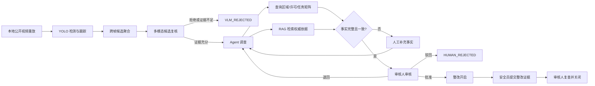

# SitePPE Agent 项目设计

## 0. 三个人现在先做什么

当前状态：单仓库目录、FastAPI 健康接口、初版 Pydantic 共享契约、React/Vite 入口和 YOLO 训练配置骨架已经存在。下一步不是继续搭骨架，而是先冻结共享契约，再由三个人按各自目录并行实现。

### 第一个 90 分钟

| 顺序 | 负责人 | 立即执行 | 完成标志 |
| --- | --- | --- | --- |
| 1 | Thunder（汪振龙） | 在 `backend/app/contracts.py` 整理并标出 `CandidateEvidence`、`VlmReviewResult`、`CaseSnapshot`、`AnalysisEvent` 的待确认字段 | 四个契约都能被后端测试导入，字段与第 5～7 节一致 |
| 2 | Wuweizhe（杨溢鑫） | 只审查 `CandidateEvidence` 和 `AnalysisEvent` 是否足以承载视频、轨迹、候选帧和播放时间；把缺失字段直接反馈给 Thunder | 明确回复“可实现”或给出具体字段修改清单 |
| 3 | Thxnks（郝欣冉） | 只审查 `CaseSnapshot` 和 `AnalysisEvent` 是否足以支持数据库、事件列表、详情页和状态时间线；把缺失字段直接反馈给 Thunder | 明确回复“可实现”或给出具体字段修改清单 |
| 4 | Thunder（汪振龙） | 合并两人的必要修改，补共享契约测试，运行 `cd backend && python -m pytest` | 测试通过；四个共享契约冻结并通知两名依赖方 |

共享契约冻结后，三个人分别从这里开始：

| 负责人 | 第一项独立任务 | 当天应交付的可见结果 |
| --- | --- | --- |
| Wuweizhe（杨溢鑫） | 执行 `W-01 数据审计` | 数据集可复现下载，输出划分、类别、哈希重复和许可信息 |
| Thxnks（郝欣冉） | 执行 `X-01 数据库与种子数据` | SQLite 能初始化，六路通道和业务上下文能被查询 |
| Thunder（汪振龙） | 执行 `T-01 状态机` | 合法流转通过，越权和非法流转被拒绝 |

### 看文档的最短路径

1. 先看第 10 节，只执行自己名下按编号排序的任务卡。
2. 做到任务卡中的“完成标志”后，再把交付物交给“依赖方”。
3. 联调前看第 11 节，确认当天入口条件已经满足。
4. 交付前按第 12 节逐项验收；未满足的条目不能口头算完成。

## 1. 产品定义

### 1.1 最终要交付什么

SitePPE Agent 是面向施工总承包项目部安全管理团队的模拟产品。核心业务对象是 `PPE 整改事件`，而非检测框、聊天会话或普通告警。

| 产品环节 | 具体结果 | 主负责人 | 完成后交给 |
| --- | --- | --- | --- |
| 主动发现 | 连续分析施工视频，使用 YOLO 检测、跟踪并聚合跨帧 PPE 缺失候选 | Wuweizhe | Thunder 的 VLM 流程 |
| 判断适用性 | VLM 复核视觉证据；Agent 查询区域、许可和任务要求；RAG 提供权威依据 | Thunder | Thxnks 的事件页面 |
| 形成闭环 | 安全员补事实和整改证据；审核人批准、退回、复查和关闭；系统全程留痕 | Thunder 负责后端，Thxnks 负责页面 | 三人共同验收 |

一句话价值主张：**让监控发现的问题，成为有依据、可整改、可追溯的安全事件。**

### 1.2 范围边界

| 必须做到 | 明确不做 |
| --- | --- |
| 面向单个施工项目部安全管理团队 | 多项目切换、集团驾驶舱和集团级权限 |
| 管理项目内摄像头、区域、作业许可、事件和整改闭环 | 多租户隔离和企业级账号体系 |
| 输出调查建议、证据和权威引用 | 自动执法、自动判定违规或自动消除事故 |
| 由人作最终结论并独占关闭权 | 让 YOLO、VLM 或 Agent 自动关闭事件 |

未来可以汇总多项目的事件、关闭耗时和重复风险，但不进入本次实现。

### 1.3 演示时展示哪些收益

课程演示不虚构事故下降比例，只展示从真实事件记录计算的过程指标。

| 指标 | 数据产生位置 | 页面负责人 |
| --- | --- | --- |
| 候选产生到进入人工审核的耗时 | 候选、VLM、调查和状态时间戳 | Thxnks |
| YOLO 候选经 VLM 拒绝或转入调查的比例 | `vlm_reviews` 与事件状态 | Thxnks |
| 因数据缺失或冲突进入人工补充的事件数 | `NEEDS_HUMAN_FACTS` 状态 | Thxnks |
| 从整改开启到审核关闭的耗时 | 状态变化记录 | Thxnks |
| 按区域、任务和 PPE 类型统计的重复风险 | 事件与模拟业务上下文 | Thxnks |
| 关闭事件的证据、调查、引用和人工操作完整率 | 事件详情聚合结果 | Thunder 提供 API，Thxnks 展示 |

### 1.4 MVP 工作包

先完成视觉入口：

| 编号 | 必须实现 | 负责人 | 对应任务 |
| --- | --- | --- | --- |
| `M-01` | 使用 Ultralytics Construction-PPE 数据集训练并评估 YOLO | Wuweizhe | `W-01`、`W-02` |
| `M-02` | 下载公开视频为本地演示文件，按连续视频流重放和推理 | Wuweizhe | `W-03` |
| `M-03` | 处理未戴安全帽、护目镜、手套、安全鞋和高可视背心五类候选 | Wuweizhe | `W-03`、`W-04` |
| `M-04` | 只有持续出现的 YOLO 候选才能提交 VLM | Wuweizhe | `W-04` |

再完成调查闭环：

| 编号 | 必须实现 | 负责人 | 对应任务 |
| --- | --- | --- | --- |
| `M-05` | 只有证据充分的 VLM 复核结果才能启动 Agent | Thunder | `T-02` |
| `M-06` | Agent 查询动态模拟业务数据和权威依据；缺失或冲突时请求人工补充 | Thunder | `T-03` |
| `M-07` | 安全员提交事实和整改证据；审核人批准、驳回、退回和关闭 | Thunder、Thxnks | `T-01`、`X-04` |
| `M-08` | 前端展示视频、候选证据、调查过程、权威引用和状态变化 | Thunder、Thxnks | `T-04`、`X-03`、`X-04` |

### 1.5 训练数据与事件映射

Wuweizhe 固定使用 [Ultralytics Construction-PPE 官方数据集](https://docs.ultralytics.com/datasets/detect/construction-ppe/)。官方提供 `construction-ppe.yaml` 和 GitHub Release 下载源。数据集约 178.4 MB，含 1,416 张标注图片：训练集 1,132 张、验证集 143 张、测试集 141 张。首次下载时必须记录来源 URL、版本、许可和文件哈希。数据集标示为 AGPL-3.0，报告和发布材料必须保留来源与引用。

数据集含 11 类：`helmet`、`gloves`、`vest`、`boots`、`goggles`、`none`、`Person`、`no_helmet`、`no_goggle`、`no_gloves`、`no_boots`。沿用官方划分，不重划或补标。训练前用精确哈希和感知哈希查重，统计各类实例数和跨集合重复。`none` 不生成业务事件。

| 产品事件 | YOLO 候选形成方式 | 多模态复核重点 | Agent 调查重点 |
| --- | --- | --- | --- |
| 未戴安全帽 | `Person + no_helmet` | 头部可见、对象关联、海报/反光、跨帧持续 | 区域、许可和当前任务是否要求头部防护 |
| 未戴护目镜 | `Person + no_goggle` | 面部与眼部可见、遮挡、对象关联 | 任务是否存在飞溅、强光或粉尘等眼部危害 |
| 未戴手套 | `Person + no_gloves` | 双手可见、工具或物料遮挡、对象关联 | 任务要求的手部防护以及旋转设备卷入风险 |
| 未穿安全鞋 | `Person + no_boots` | 足部可见、遮挡、对象关联 | 是否处于受控作业区及任务所需足部防护 |
| 未穿高可视背心 | `Person` 轨迹持续存在且未关联 `vest` | 躯干完整可见、背心关联、颜色与遮挡 | 区域和任务是否要求高可视警示服 |

执行限制：前四类直接使用负类标签；数据集没有 `no_vest`，第五类必须由 `Person` 持续未关联 `vest` 形成候选并经 VLM 复核。Wuweizhe 不得新增或伪造标签，Thunder 不得让 VLM 补造 YOLO 未产生的候选。

## 2. 用户与人工职责

### 2.1 两类演示角色

| 角色 | 页面上必须能做 | 后端必须拦截 | 实现负责人 |
| --- | --- | --- | --- |
| 现场安全员 | 查看视频、候选和调查进度；确认或更正现场任务、作业条件与例外；提交整改说明和前后证据 | 最终关闭事件 | Thunder 实现权限，Thxnks 实现页面动作 |
| 项目安全审核人 | 批准、驳回、退回重查；确认或修改 Agent 推荐的责任班组/岗位和期限；批准整改开启、复查并关闭 | 无证据直接关闭 | Thunder 实现权限，Thxnks 实现页面动作 |

### 2.2 开发动作

| 顺序 | 负责人 | 动作 | 完成标志 |
| --- | --- | --- | --- |
| 1 | Thxnks | 在 SQLite 种子中预置两类角色和固定 `actor_id` | `/api/v1/demo/context` 能返回演示角色 |
| 2 | Thunder | 在 `CaseWorkflow` 校验角色、状态、证据和 `actor_id` | 越权命令测试全部失败并返回明确原因 |
| 3 | Thxnks | 在页面顶部提供角色切换，并按角色和状态显示操作 | 安全员看不到关闭按钮，审核人看不到无效动作 |
| 4 | Thunder | 为每次人工动作写审计日志 | 事件时间线包含执行人、动作、前后状态和时间 |

MVP 不实现登录、注册、密码找回和企业级鉴权。角色切换只用于演示，不能绕过后端权限校验。

## 3. 主流程

### 3.1 模块交接顺序

| 步骤 | 输入 → 输出 | 执行模块 | 负责人 | 失败时去向 |
| --- | --- | --- | --- | --- |
| 1 | 本地视频 → 跟踪后的跨帧候选 | `VideoAnalysis` | Wuweizhe | 不创建候选，保留推理日志 |
| 2 | 候选窗口 → 结构化视觉复核 | `VlmReview` | Thunder | `VLM_REJECTED` |
| 3 | 已确认候选 → 业务事实与权威引用 | `Investigation`、`RequirementsRag` | Thunder | `NEEDS_HUMAN_FACTS` |
| 4 | 调查结果 → 审核决定与整改任务 | `CaseWorkflow`、事件详情页 | Thunder、Thxnks | 驳回或退回调查 |
| 5 | 整改证据 → 复查结果和关闭记录 | `CaseWorkflow`、事件详情页 | Thunder、Thxnks | 复查不通过，回到整改中 |



执行限制：演示只使用预下载视频。Wuweizhe 的后端模块按帧读取、限速播放并持续推送结果，模拟摄像头流；任何人都不得用一次性图片上传冒充连续视频。

## 4. 状态机

### 4.1 Thunder 先实现的状态集合

`YOLO_CANDIDATE → VLM_REVIEWED → INVESTIGATING → NEEDS_HUMAN_FACTS / PENDING_REVIEW → RECTIFICATION_OPEN → RECHECK_PENDING → CLOSED`

终止或回退状态：`VLM_REJECTED`、`HUMAN_REJECTED`、`REINVESTIGATE`。

### 4.2 自动阶段：系统动作

| 当前状态 | 动作 | 下一状态 | 执行者 |
| --- | --- | --- | --- |
| `YOLO_CANDIDATE` | 多模态确认 | `VLM_REVIEWED` | 系统 |
| `YOLO_CANDIDATE` | 多模态拒绝/证据不足 | `VLM_REJECTED` | 系统 |
| `VLM_REVIEWED` | 启动调查 | `INVESTIGATING` | 系统 |
| `INVESTIGATING` | Agent 结果表明缺少或冲突事实 | `NEEDS_HUMAN_FACTS` | 系统（`CaseWorkflow`） |
| `INVESTIGATING` | Agent 形成带引用的建议 | `PENDING_REVIEW` | 系统（`CaseWorkflow`） |
| `REINVESTIGATE` | 重新调查 | `INVESTIGATING` | 系统 |

### 4.3 人工阶段：角色动作

| 当前状态 | 动作 | 下一状态 | 执行者 |
| --- | --- | --- | --- |
| `NEEDS_HUMAN_FACTS` | 提交现场事实 | `REINVESTIGATE` | 现场安全员 |
| `PENDING_REVIEW` | 驳回候选 | `HUMAN_REJECTED` | 项目安全审核人 |
| `PENDING_REVIEW` | 退回调查 | `REINVESTIGATE` | 项目安全审核人 |
| `PENDING_REVIEW` | 确认责任班组/岗位和截止时间并批准整改 | `RECTIFICATION_OPEN` | 项目安全审核人 |
| `RECTIFICATION_OPEN` | 提交整改证据 | `RECHECK_PENDING` | 现场安全员 |
| `RECHECK_PENDING` | 复查不通过 | `RECTIFICATION_OPEN` | 项目安全审核人 |
| `RECHECK_PENDING` | 复查通过 | `CLOSED` | 项目安全审核人 |

### 4.4 三个人分别验证什么

| 负责人 | 必须验证 | 完成标志 |
| --- | --- | --- |
| Thunder | 每条允许流转、所有越权动作、缺证据、旧版本号和非法命令 | `CaseWorkflow` 测试逐行覆盖上面两张表 |
| Thxnks | 页面只显示当前角色、当前状态允许的动作 | mock 与真实 API 下的按钮集合一致 |
| Wuweizhe | 视觉模块只创建 `YOLO_CANDIDATE`，不跳过 VLM 或调查 | `CandidateEvidence` 输出不包含人工结论或目标状态 |

所有状态校验只集中在 `CaseWorkflow`。路由、Agent 和仓储不得重复状态判断；前端只负责隐藏无效动作，不能代替后端鉴权。

## 5. 系统模块

采用单仓库：`frontend`、`backend` 和 `ml` 三个顶层目录。数据库使用 SQLite，降低三人协作和演示部署成本。

| 模块 | 负责人 | 依赖 | 可以独立验收的结果 |
| --- | --- | --- | --- |
| `VideoAnalysis` | Wuweizhe | 冻结的 `CandidateEvidence`、视频种子信息 | 离线视频产生去重后的结构化候选和标注流 |
| `VlmReview` | Thunder | `CandidateEvidence` fixture 或真实候选 | 证据充分才确认，其他情况稳定拒绝 |
| `Investigation`、`RequirementsRag` | Thunder | 种子业务数据、有效权威语料 | 三类调查用例有引用、差异和缺失分支 |
| `CaseWorkflow` | Thunder | `CaseStore` interface | 合法状态流转成功，越权与非法流转失败 |
| `CaseStore` 和页面 | Thxnks | 共享契约和 API 约定 | SQLite 事务正确，事件列表与详情可操作 |

```text
frontend/
  src/
    pages/
    features/monitor/
    features/cases/
    features/review/
    shared/
backend/
  app/
    api/
    domain/
    modules/video_analysis/
    modules/vlm_review/
    modules/investigation/
    modules/requirements_rag/
    adapters/
    repositories/
  tests/
ml/
  configs/
  scripts/
  reports/
data/
  demo/          # 不提交视频
  models/        # 不提交权重
```

### 5.1 `VideoAnalysis` 模块

负责人：Wuweizhe。先按以下顺序交付，每一步都能独立运行。

| 顺序 | 实现动作 | 验收结果 |
| --- | --- | --- |
| 1 | 解码本地视频并按配置限速 | 能从指定 `video_id` 连续输出帧和 `playback_ms` |
| 2 | 接 YOLO 与 ByteTrack 或等价跟踪器 | 标注画面含框、类别、置信度和匿名轨迹 |
| 3 | 按连续帧或时间窗口聚合候选 | 同一轨迹同一 PPE 缺失只形成一个候选 |
| 4 | 缓存证据帧并转换为 `CandidateEvidence` | Pydantic 校验通过，时间与摄像头上下文正确 |
| 5 | 提供标注流和轻量事件订阅 | Thunder 不接触 OpenCV、YOLO Result 或跟踪器对象 |

对外接口固定为：

```python
start_session(video_id: str) -> AnalysisSession
get_stream(session_id: str) -> Iterator[bytes]
subscribe_events(session_id: str) -> AsyncIterator[AnalysisEvent]
stop_session(session_id: str) -> None
```

上述接口内部完成视频解码、播放限速、YOLO 推理、跟踪、候选聚合、证据帧缓存和标注画面编码。调用方不接触 OpenCV 帧、YOLO Result 或 ByteTrack 对象。

并发规则：监控台可以同时预览六个本地公开视频，但 MVP 只允许运行一个完整分析会话。用户切换通道时，Thunder 调用 `stop_session` 停止旧分析，再为新通道调用 `start_session`；旧通道已生成的事件和 Agent 调查必须保留。Wuweizhe 按配置抽帧推理，例如 5 FPS，渲染帧可以保持原视频帧率。

时间规则：每个演示视频固定绑定一个摄像头和 `scenario_started_at`。`VideoAnalysis` 必须用 `scenario_started_at + playback_ms` 计算模拟业务时间并写入候选证据；不得使用服务器当前时间或公开视频原始拍摄日期。Agent 工具只接收换算后的时间戳。

### 5.2 `VlmReview` 模块

负责人：Thunder。输入来自 Wuweizhe 的候选，输出交给 `CaseWorkflow`。

| 顺序 | 实现动作 | 验收结果 |
| --- | --- | --- |
| 1 | 用固定响应 adapter 完成结构化解析与状态分支 | 不联网也能跑全部单元测试 |
| 2 | 接 `TransformersVlmAdapter` | 单张 4090 可运行候选窗口复核并记录耗时 |
| 3 | 接 `OpenAiCompatibleVlmAdapter` | 切换配置不改变 `VlmReview` interface |
| 4 | 用同一批候选对比 Gemma 4 视觉版本、Qwen-VL 或视觉 API | 有显存、延迟、结构化成功率和复核效果记录后再锁定模型 |

对外接口固定为：

```python
review(candidate: CandidateEvidence) -> VlmReviewResult
```

输入范围：只包含候选前后若干帧、检测框、ROI、轨迹编号、PPE 类别和时间戳。Thunder 禁止把整段视频交给多模态模型扫描。

结构化输出：

```json
{
  "verdict": "CONFIRMED | REJECTED | UNCERTAIN",
  "person_track_id": "track-12",
  "ppe_type": "helmet",
  "association": "MATCHED | AMBIGUOUS",
  "body_part_visible": true,
  "persistent": true,
  "poster_or_reflection": false,
  "evidence_sufficient": true,
  "evidence_timestamps_ms": [12300, 12700, 13100],
  "reason": "三帧中头部清晰可见且未发现安全帽"
}
```

状态规则：任何解析失败、超时、`UNCERTAIN` 或 `evidence_sufficient=false` 都进入 `VLM_REJECTED`，不得启动 Agent。只有 `CONFIRMED` 且证据充分时，系统才自动进入 `INVESTIGATING`；不要求人工再次点击，人工仍独占事实补充、审核、整改证据和最终关闭。

多模态模型通过 `VlmModelPort` seam 接入。`VlmReview` 只依赖该 interface，不读取供应商 SDK 或部署地址：

```python
class VlmModelPort(Protocol):
    async def complete(self, request: VlmRequest) -> VlmRawResponse: ...
```

| adapter 规则 | 必须遵守 |
| --- | --- |
| 本地生产方案 | `TransformersVlmAdapter` 直接调用本地模型，不经过 LangChain |
| 云端或独立服务方案 | 使用 `OpenAiCompatibleVlmAdapter`，不改变 `VlmReview` interface |
| 测试方案 | 使用固定响应 adapter，不发起真实模型请求 |
| 业务代码边界 | 只依赖 `VlmModelPort`，禁止判断供应商或具体模型名称 |

### 5.3 `Investigation` 模块

负责人：Thunder。输入是已通过 VLM 的事件编号；输出是只读调查结果，不是状态修改命令。

| 顺序 | 实现动作 | 验收结果 |
| --- | --- | --- |
| 1 | 为五个工具定义 Pydantic 输入输出并用固定数据测试 | 工具无权执行任意 SQL、HTTP、Shell 或 Python |
| 2 | 接入 `ChatDeepSeek` 非思考模式，限制步数、单工具超时和总超时 | 超时和结构化错误可控，工具轨迹可展示 |
| 3 | 本地校验 `InvestigationResult` | 缺失、冲突、引用和责任建议字段可判定 |
| 4 | 把结果交给 `CaseWorkflow` | Agent 自身不能进入任何人工业务状态 |
| 5 | 跑三类固定对照场景 | 普通/切割、搬运/旋转设备、缺许可/冲突产生预期差异 |

对外接口固定为：

```python
investigate(case_id: str) -> InvestigationResult
```

Agent 只能调用以下只读调查工具，工具实现从 Thxnks 的种子数据库读取数据：

```text
get_zone_at(camera_id, timestamp)
find_active_work_permits(zone_id, timestamp)
get_task_ppe_matrix(task_code)
list_eligible_responsible_parties(zone_id, timestamp)
search_authoritative_requirements(hazard, trade, date)
```

模型边界：`Investigation` 使用 LangChain 创建工具调用 Agent，但不调用多模态模型。LangChain 通过 `ChatDeepSeek` 连接 DeepSeek 官方 API，不提供本地文本模型方案。默认使用 `deepseek-v4-flash`；模型名可配置，但更换 DeepSeek 型号不得改变工具 interface。

配置边界：文本 Agent 只读取 `DEEPSEEK_API_KEY`、`AGENT_LLM_MODEL`、`AGENT_LLM_TIMEOUT_SECONDS` 和重试次数等配置。DeepSeek endpoint 固定为官方 `https://api.deepseek.com`；API 密钥只保存在未提交的环境变量中，不得复用 VLM 配置名。DeepSeek 客户端只能存在于本模块 adapter，不能散落在工具或路由中。

运行方式：MVP 使用 DeepSeek 非思考模式，调用 V4 API 时显式传入 `thinking={"type": "disabled"}`。不启用 Beta strict mode；所有工具参数和最终结果由本地 Pydantic schema 校验。只有固定调查用例全部通过后，才允许试验思考模式或 strict mode。

LangChain 只承担五件事：选择工具、串行调用工具、维护有限步上下文、重试可恢复的结构化错误、记录可展示的工具轨迹。最大调查步数、单工具超时和总超时必须固定。

LangChain 不负责视频、多模态复核、数据库事务或业务状态变化。所有工具返回 Pydantic 结构化结果，数据库查询封装在具体工具内部。Agent 循环结束后，`Investigation` 服务对最终 `InvestigationResult` 做本地校验并交给 `CaseWorkflow`；是否进入 `NEEDS_HUMAN_FACTS` 或 `PENDING_REVIEW` 只由 `CaseWorkflow` 决定。

`person_track_id` 始终是单段视频内用于跨帧去重的匿名编号，不与模拟员工、真实身份、人脸或访客记录绑定。Agent 不调查画面中人员身份，也不以身份作为形成建议的前提。

`InvestigationResult` 必须是结构化对象，至少包含：事实、冲突、缺失字段、适用任务、危害、PPE 要求、建议、推荐整改责任主体、推荐截止时间、推荐理由、引用和工具调用轨迹。责任主体是预置班组或岗位，不是人员账号；推荐依据作业许可、区域职责和该责任主体当前未关闭整改数量。期限推荐只读取任务矩阵中的 `rectification_window_minutes`。Agent 只返回结构化结果，不获得任何修改业务状态的工具。

Agent 推荐不自动确定责任主体。只有审核人确认或修改责任班组/岗位和截止时间后，`CaseWorkflow` 才能进入 `RECTIFICATION_OPEN`。现场安全员代表现场记录整改说明和证据，不需要成为被指派人。截止时间到期不新增状态，而是根据 `rectification_due_at` 动态显示逾期标记。

Thunder 必须把以下三类场景写成测试：

- 同一视觉候选在普通巡查和切割/打磨许可下得到不同建议。
- 未戴手套在钢筋搬运和旋转设备操作下得到不同解释。
- 区域没有有效许可、多个许可冲突或现场任务不明确时请求人工事实，不猜测结论。

### 5.4 `RequirementsRag` 模块

负责人：Thunder。语料核验、索引和检索必须先于 Agent 联调完成。

| 顺序 | 实现动作 | 验收结果 |
| --- | --- | --- |
| 1 | 下载并人工核对官方正文、现行状态、实施日期和文件哈希 | 无法定位正文的资料不进入语料清单 |
| 2 | 按标题、标准号、章节、生效日期和来源 URL 分块 | 每个引用都能回到官方原文位置 |
| 3 | 用同一个外部 embedding 模型建库与查询 | collection 内没有混合模型或向量维度 |
| 4 | 编写固定查询集做 Top-K 召回测试 | 五类 PPE 的预期条款可召回，空查询分支返回空列表 |
| 5 | 只通过 `search_authoritative_requirements` 暴露给 Agent | Agent 不接触 Chroma、embedding 或文档分块 |

对外接口固定为：

```python
index_documents(manifest_path: str) -> IndexReport
search(query: RequirementQuery, top_k: int = 5) -> list[Citation]
```

语料边界：只收录最终审计确定的政府或国家标准平台文件。每个分块保存 `document_title`、`standard_no`、`section`、`effective_date`、`source_url`、`text` 和文件哈希。

MVP 首批语料固定从以下官方来源获取；Thunder 入库前再次核对官方页面的现行状态、实施日期和文件完整性：

1. [GB 39800.12-2025《个体防护装备配备规范 第12部分：建筑》](https://openstd.samr.gov.cn/bzgk/std/newGbInfo?hcno=225DB0D16D458885C1C984AB6AA44012)：建筑行业 PPE 危害辨识和配备依据，2026-07-01 实施。
2. [GB 39800.1-2020《个体防护装备配备规范 第1部分：总则》](https://openstd.samr.gov.cn/bzgk/std/newGbInfo?hcno=B8071B9B0A429EB6067597A7C98629C9)：个体防护装备配备通用要求。
3. [《建筑工人施工现场劳动保护基本配置指南》](https://www.gov.cn/zhengce/zhengceku/2021-01/19/5580999/files/10d98ecac8cd4c68a887b0519b56768b.pdf)：安全帽、眼部防护、手套、安全鞋和反光背心等施工现场配置参考。
4. [GB 55034-2022《建筑与市政施工现场安全卫生与职业健康通用规范》](https://policy.mofcom.gov.cn/claw/clawContent.shtml?id=96208)：施工现场安全卫生与职业健康通用要求。
5. [市监质监发〔2025〕77号专项整治方案](https://www.samr.gov.cn/zw/zfxxgk/fdzdgknr/zljds/art/2025/art_06f5f34df2f44ba9ae240f3498bc73af.html)：PPE 现场检查、正确佩戴和标准执行的管理背景依据。

引用规则：前四项用于检索具体防护要求；第五项只解释检查和管理背景，不替代具体 PPE 配备条款。若无法从官方页面取得可核验的正文、章节或表格定位，Thunder 不得将该文档作为事件引用。

数据隔离：检索结果必须返回原文片段和定位信息；检索为空时返回空列表，Agent 不得补写条款。Thxnks 提供的任务矩阵、作业许可和区域责任数据不得进入向量库。

LangChain 的文档加载、分块和 Retriever 集成可以放在该模块的 implementation 内，但 `Investigation` 只能调用 `search_authoritative_requirements` 工具，不得直接操作 Chroma collection、embedding 模型或文档分块。这样 RAG 可以独立做召回测试，也可以在不改 Agent 工具 interface 的前提下替换检索实现。

Embedding 只调用外部 API，不下载或部署本地 embedding 模型。`RequirementsRag` 通过一个 embedding adapter 读取 `EMBEDDING_BASE_URL`、`EMBEDDING_API_KEY`、`EMBEDDING_MODEL` 和超时配置；这些配置与 DeepSeek Agent 完全独立。测试使用固定向量 adapter，不发起真实网络请求。

文档分块与查询必须使用同一个 embedding 模型。向量和引用元数据持久化到本地 ChromaDB；更换模型或向量维度后必须重建整个 collection，禁止把不同模型产生的向量混入同一索引。具体 API 供应商和模型稍后通过小规模召回测试确定。

### 5.5 `CaseWorkflow` 模块

负责人：Thunder。此模块是唯一可以决定业务状态变化的位置。

| 实现动作 | 完成标志 |
| --- | --- |
| 为七个命令定义输入 schema | 前端不能直接提交目标状态 |
| 校验当前状态、角色和必填证据 | 越权、错状态和缺证据都有测试 |
| 使用 `expected_version` 调用 `CaseStore.commit` | 并发冲突不会覆盖新数据 |
| 写入审计 transition | 每次成功动作都能在时间线追溯 |

```python
apply(case_id: str, command: CaseCommand, actor: Actor) -> CaseSnapshot
```

`apply` 内部统一完成状态合法性、角色权限、必填证据、乐观并发版本号和审计日志。前端只提交业务命令，不直接提交目标状态。

命令包括：`SubmitFacts`、`ApproveRectification`、`RejectCase`、`RequestReinvestigation`、`SubmitRectificationEvidence`、`ApproveClosure`、`RejectRecheck`。

## 6. 数据模型

负责人：Thxnks。先做能支撑 Agent 查询的业务上下文表，再做事件闭环表；Thunder 只能通过 `CaseStore` 和只读调查工具使用数据。

| 实施顺序 | 数据范围 | 完成标志 |
| --- | --- | --- |
| 1 | `users`、`responsible_parties`、`cameras`、`zones` | 两类角色、责任主体、六个摄像头和区域可查询 |
| 2 | `videos`、`work_permits`、`task_ppe_matrix` | 六路视频绑定模拟时间；三个 Agent 对照场景具备种子数据 |
| 3 | `analysis_sessions`、`cases`、`case_evidence`、`vlm_reviews`、`investigations`、`citations` | 从候选到待审核的机器链路可持久化 |
| 4 | `human_submissions`、`case_transitions` | 人工事实、整改证据和所有状态变化可追溯 |

| 表 | 关键字段 | 主要使用方 |
| --- | --- | --- |
| `users` | `id`, `name`, `role`, `active` | 角色切换、`CaseWorkflow` |
| `responsible_parties` | `id`, `name`, `kind`, `zone_id`, `active` | Agent 推荐、审核人确认 |
| `videos` | `id`, `camera_id`, `title`, `local_path`, `source_url`, `duration_ms`, `scenario_started_at` | 监控台、`VideoAnalysis` |
| `cameras` | `id`, `name`, `zone_id` | 监控台、区域查询工具 |
| `zones` | `id`, `name`, `zone_type` | Agent 区域上下文 |
| `work_permits` | `id`, `zone_id`, `task_code`, `hazards_json`, `responsible_party_id`, `starts_at`, `ends_at`, `status` | Agent 许可查询 |
| `task_ppe_matrix` | `task_code`, `hazard`, `required_ppe_json`, `exception_note`, `rectification_window_minutes` | Agent PPE 与期限建议 |
| `analysis_sessions` | `id`, `video_id`, `status`, `started_at`, `playback_ms` | 单路分析状态 |
| `cases` | `id`, `session_id`, `camera_id`, `ppe_type`, `track_id`, `status`, `version`, `rectification_responsible_party_id`, `rectification_due_at`, `created_at` | 事件列表、详情和工作流 |
| `case_evidence` | `id`, `case_id`, `kind`, `timestamp_ms`, `path`, `metadata_json` | 候选帧、检测框、整改证据 |
| `vlm_reviews` | `case_id`, `verdict`, `result_json`, `model_name`, `created_at` | 详情页、VLM 指标 |
| `investigations` | `case_id`, `facts_json`, `conflicts_json`, `missing_fields_json`, `recommendation`, `trace_json` | Agent 报告和时间线 |
| `citations` | `id`, `case_id`, `document_title`, `standard_no`, `section`, `effective_date`, `source_url`, `excerpt` | 详情页权威引用 |
| `human_submissions` | `id`, `case_id`, `actor_id`, `kind`, `payload_json`, `created_at` | 现场事实和整改证据 |
| `case_transitions` | `id`, `case_id`, `from_status`, `to_status`, `actor_id`, `reason`, `created_at` | 审计时间线和耗时指标 |

建模限制：检测框只保存在 `case_evidence.metadata_json`，不为课程项目建立更细的视觉数据表。

Thxnks 将 SQLAlchemy session、表关联和事务全部隐藏在 `CaseStore` interface 后：

```python
create(snapshot: CaseSnapshot) -> CaseSnapshot
get(case_id: str) -> CaseSnapshot | None
list(query: CaseQuery) -> list[CaseSnapshot]
commit(snapshot: CaseSnapshot, expected_version: int, transition: CaseTransition) -> CaseSnapshot
```

验收方式：`commit` 在同一 SQLite 事务内更新事件快照、写入状态变化并递增版本号；版本不匹配时返回并发冲突。测试使用 SQLite 内存数据库运行真实实现，不再额外维护假数据库。Thunder 的状态机、Agent 和路由只调用该 interface，不直接操作 SQLAlchemy model。

## 7. 后端接口

负责人：Thunder。先用 fixture 让 API 可测，再接 Wuweizhe 的 `VideoAnalysis` 和 Thxnks 的 `CaseStore`。

### 7.1 视频与实时事件

| 方法与路径 | 后端动作 | 前端使用方 | 完成标志 |
| --- | --- | --- | --- |
| `GET /api/v1/demo/videos` | 返回六路固定视频元数据 | 监控台 | 六个通道与 SQLite 种子一致 |
| `GET /api/v1/demo/videos/{id}/content` | 返回未标注本地视频 | 六路预览 | 支持浏览器播放和范围请求 |
| `POST /api/v1/analysis-sessions` | 停止旧会话并启动选中通道分析 | 监控台 | 任意时刻只有一个完整分析会话 |
| `POST /api/v1/analysis-sessions/{id}/stop` | 停止指定分析 | 监控台 | 释放推理资源但保留已生成事件 |
| `GET /api/v1/analysis-sessions/{id}/stream.mjpg` | 返回 YOLO 标注流 | 放大通道 | 标注画面与当前会话一致 |
| `WS /ws/v1/analysis-sessions/{id}/events` | 推送轻量分析事件 | 实时侧栏 | 断线可重连，详情不在 WS 重复传输 |

### 7.2 事件闭环

| 方法与路径 | 后端动作 | 页面使用方 | 完成标志 |
| --- | --- | --- | --- |
| `GET /api/v1/cases` | 按状态和 PPE 查询事件与统计 | 事件中心 | 筛选和四个指标来自真实记录 |
| `GET /api/v1/cases/{id}` | 聚合事件、证据、VLM、调查、引用和时间线 | 事件详情 | 单次请求足以渲染详情页 |
| `POST /api/v1/cases/{id}/facts` | 执行 `SubmitFacts` | 安全员表单 | 合法提交进入重新调查 |
| `POST /api/v1/cases/{id}/review` | 执行审核命令 | 审核人操作区 | 只接受三种审核动作 |
| `POST /api/v1/cases/{id}/rectification-evidence` | 执行 `SubmitRectificationEvidence` | 安全员整改区 | 证据完整后进入待复查 |
| `POST /api/v1/cases/{id}/recheck` | 执行复查命令 | 审核人复查区 | 只接受通过关闭或退回整改 |

### 7.3 演示解释与检索

| 方法与路径 | 返回内容 | 完成标志 |
| --- | --- | --- |
| `GET /api/v1/demo/context` | 摄像头、区域、作业许可、任务矩阵和责任主体 | 只读返回种子数据，不提供配置后台 |
| `GET /api/v1/requirements/search?q=...` | 带官方定位信息的 Top-K 引用 | 空结果返回空列表，不生成伪引用 |

命令限制：`/review` 只接受 `APPROVE_RECTIFICATION`、`REJECT_CASE`、`REQUEST_REINVESTIGATION`；`/recheck` 只接受 `APPROVE_CLOSURE`、`REJECT_RECHECK`。禁止提供通用的 `PATCH /cases/{id}/status`。

传输边界：WebSocket 只推送会话进度、YOLO 候选、VLM 结果、调查状态和新事件编号；详情始终通过 REST 获取，避免在实时通道复制完整业务对象。

数据边界：`/api/v1/demo/context` 只读返回 SQLite 种子数据，供演示解释 Agent 查询结果。MVP 不提供这些数据的新增、编辑或删除接口。

## 8. 前端页面

页面分工：Thunder 负责监控台和公共路由整合；Thxnks 负责事件中心、事件详情和人工操作组件。两人都使用共享 API client，不在页面中复制业务状态判断。

### 监控台 `/monitor`

负责人：Thunder。先用固定视频和 mock WebSocket 完成布局，再接真实视频接口。

| 页面区域 | 具体要做 | 完成标志 |
| --- | --- | --- |
| `2×3` 视频墙 | 同时播放六个预置公开视频 | 六路预览互不阻塞，不消耗六路推理资源 |
| 通道选择 | 明确高亮选中通道；切换时先停旧会话再开新会话 | 后台任意时刻只有一个完整分析会话 |
| 选中通道 | 显示 YOLO 标注、播放时间、处理 FPS、最新候选和 VLM 结果 | 数据来自当前 session，不混入旧通道 |
| 放大与侧栏 | 放大选中通道，实时列出轻量事件 | 点击事件可以进入 `/cases/:id` |
| 演示上下文 | 从 SQLite 种子读取视频、摄像头和业务上下文 | 监控台没有新增、编辑或删除配置入口 |

Thxnks 在种子数据中建立以下六个通道；Wuweizhe 验证视频候选；Thunder 验证预期流程：

| 通道 | 视频候选 | 模拟业务上下文 | 预期流程 |
| --- | --- | --- | --- |
| `CAM-01` | 未戴安全帽 | 区域无有效许可或现场任务不明确 | 请求人工补充事实 |
| `CAM-02` | 切割作业未戴护目镜 | 有效切割许可和眼部危害 | 形成整改建议 |
| `CAM-03` | 搬运钢筋未戴手套 | 手部伤害风险 | 形成整改建议 |
| `CAM-04` | 旋转设备旁未戴手套 | 存在卷入风险，不宜简单要求戴手套 | 与 `CAM-03` 产生不同结论 |
| `CAM-05` | 车辆作业区未穿反光背心 | 区域要求高可视服 | 形成整改建议 |
| `CAM-06` | PPE 穿戴正确 | 普通作业许可 | 不创建整改事件 |

安全鞋仍作为已训练的产品事件类型和测试集指标展示，不强求进入六路视频演示。

#### 公共视频候选池

Wuweizhe 负责首轮下载和模型试验。以下素材在完成授权确认和视觉验收前都只是候选：

| 候选素材 | 试验用途 | 锁定条件 |
| --- | --- | --- |
| [Bilibili：AI 智能识别未戴安全帽行为](https://www.bilibili.com/video/BV1fV4y177QU/) | 未戴安全帽流程 | YOLO 可形成稳定候选且使用依据可记录 |
| [YouTube：Construction Safety Training Video](https://www.youtube.com/watch?v=lfoTLeFooR4) | `0:27` 工地着装、`0:51` 眼部防护、`1:44` 工作手套的正确 PPE 或对照片段 | 片段可下载、可授权且能作为阴性/对照样例 |
| [Bilibili：336 集现场施工合集](https://www.bilibili.com/video/BV1x4411w7zJ/) | 金属截断、乙炔切割、钢筋加工和日常施工 | 下载后锁定具体分 P、时间段和摄像头 |
| [Reddit：How many OSHA violations?](https://www.reddit.com/r/funny/comments/18p791t/how_many_osha_violations/) | 手套、安全帽和高可视服缺失的组合场景 | 可下载且取得使用授权 |

每个最终视频必须记录平台、原始链接、下载日期、授权或使用依据、选取时间段和摄像头编号。平台标题、描述和评论不能作为视觉真值；最终是否产生候选只由实际 YOLO、跨帧聚合和 VLM 复核结果决定。

### 事件中心 `/cases`

负责人：Thxnks。先用 mock `CaseSnapshot` 完成所有展示状态，再接 `GET /api/v1/cases`。

| 页面能力 | 具体要做 | 完成标志 |
| --- | --- | --- |
| 筛选 | 按状态和 PPE 类型筛选 | URL 或页面状态可复现当前筛选条件 |
| 列表卡片 | 显示证据缩略图、匿名轨迹、区域、任务和整改责任主体 | 不显示人员身份，不把轨迹当员工编号 |
| 状态表达 | 区分机器候选、待补事实、待审核、整改中和待复查 | 状态文案与 `CaseStatus` 一一映射 |
| 顶部指标 | 显示未关闭数、待人工补充数、平均关闭耗时和重复风险最多的区域/任务 | 指标只从真实事件记录计算，不写死演示数字 |

### 事件详情 `/cases/:id`

负责人：Thxnks。Thunder 提供聚合详情和命令 API，Thxnks 不在前端自行计算下一状态。

| 页面区域 | 具体要做 | 完成标志 |
| --- | --- | --- |
| 证据时间线 | 按时间展示 YOLO、VLM、Agent、RAG 和人工操作 | 每项含来源、时间和可读结果 |
| 调查报告 | 展示候选帧、检测框、VLM 理由、工具调用摘要和权威引用 | 引用可打开官方来源，空引用明确显示未检索到 |
| 安全员操作 | 填写现场事实或记录整改说明与前后证据 | 只在允许状态显示，提交携带 `actor_id` 和 `version` |
| 审核人操作 | 批准、驳回、退回、复查和关闭 | 批准整改前必须确认或修改责任班组/岗位和期限 |
| 打印报告 | 汇总检测帧、VLM、Agent、引用、整改证据和完整时间线 | 浏览器打印时内容完整且不依赖聊天记录 |

页面必须明确区分“Agent 推荐”和“人工最终确认”。不制作聊天页；Agent 调查以自动任务和结构化报告呈现。

## 9. 技术选型

| 部分 | 锁定选择 | 使用者 | 不再讨论的替代项 |
| --- | --- | --- | --- |
| 前端 | React、TypeScript、Vite | Thunder、Thxnks | 不换成 Streamlit 或移动端 |
| 后端 | Python、FastAPI、Pydantic、SQLAlchemy、SQLite | Thunder、Thxnks | 数据库不切 MySQL |
| 视频 | OpenCV、MJPEG、WebSocket | Wuweizhe、Thunder | 不做 WebRTC 和六路并发推理 |
| 检测 | PyTorch、Ultralytics YOLO、ByteTrack 或等价跟踪器 | Wuweizhe | 不用 VLM 扫整段视频代替 YOLO |
| 多模态 | 本地 Transformers adapter，保留 OpenAI-compatible adapter | Thunder | 不经过 LangChain；模型对比前不锁具体 ID |
| Agent | LangChain `ChatDeepSeek` + DeepSeek API，默认 `deepseek-v4-flash` 非思考模式 | Thunder | 不提供本地文本模型，不开放任意工具 |
| RAG | LangChain 检索集成、外部 Embedding API、ChromaDB、Top-K 与元数据过滤 | Thunder | 不部署本地 embedding，不混用向量模型 |
| 测试 | pytest、HTTPX ASGITransport、TypeScript 与 Vite 生产构建 | 三人 | 不新增未配置的全局检查工具 |

范围锁定：参考工作中的 MySQL、WebRTC、多摄像头并发、复杂账号系统和移动端不进入 MVP。三个人不得为这些内容预留额外实现。

### 已确认的部署方式

#### 服务器环境：Wuweizhe 与 Thunder 执行

| 动作 | 固定约束 |
| --- | --- |
| 选择 GPU | Ubuntu 20.04 服务器有 8 张 RTX 4090；运行前先看显存，人工选一张空闲卡 |
| 限定 GPU | 使用 `CUDA_VISIBLE_DEVICES=<空闲物理卡号>`；配置中的 `device: 0` 只代表进程可见的第一张卡 |
| 建项目环境 | 在 `/opt/data/private` 使用独立目录和独立 Conda 环境；后端保持 Python 3.10—3.12 兼容 |
| 参考现有环境 | `videomama` 提供 Python 3.10.20、PyTorch 2.5.1+cu124 和 CUDA，只能参考或克隆，不能直接追加依赖 |
| 控制资源 | 不硬编码卡号、不自动抢卡、不默认占多卡、不重复保存模型权重、不安装 Docker |

#### 演示连接：Thunder 执行

| 动作 | 固定约束 |
| --- | --- |
| 启动后端 | FastAPI 只绑定服务器本机端口 |
| 建立连接 | 演示电脑用 SSH 本地端口转发；Vite 连接转发后的 `localhost`；REST、WS 和视频共用隧道 |
| 播放六路预览 | 优先从演示电脑本地文件播放；只有选中通道的分析、标注流和事件通过隧道 |
| 准备依赖和模型 | 默认服务器联网可解决；仍保留开发电脑下载后用 SCP/SFTP 上传的备用方式 |
| 准备降级 | SSH 隧道或服务器推理不可用时，本机运行 FastAPI 并把 VLM 切到云端 API，前后端接口不变 |

## 10. 三人并行边界

执行方法：每个人一次只推进自己任务卡中的一个编号。完成标志未满足时不交给下游；需要改共享契约时暂停当前任务，由 Thunder 统一修改。

### 10.1 目录所有权

| 开发者 | 主责 | 独占修改路径 | 第一批交付 |
| --- | --- | --- | --- |
| Wuweizhe（杨溢鑫） | 视觉与视频：数据检查、4090 上的 YOLO 训练评估、视频推理、跟踪和候选聚合 | `ml/`、`backend/app/modules/video_analysis/` | 数据审计报告、训练结果、离线推理脚本、符合 `CandidateEvidence` 的输出 |
| Thxnks（郝欣冉） | 数据库与主要前端：SQLAlchemy/SQLite、种子业务数据、仓储实现、事件中心和事件详情 | `backend/app/repositories/`、`backend/app/adapters/database/`、`frontend/src/features/cases/`、`frontend/src/features/review/` | 数据表及种子脚本、仓储测试、使用 mock 契约运行的事件页面 |
| Thunder（汪振龙） | 主要后端与部分前端：状态机、VLM、Agent、RAG、FastAPI、监控台和总联调 | `backend/app/domain/`、`backend/app/api/`、除 `video_analysis` 外的 `backend/app/modules/`、`frontend/src/features/monitor/` | `CaseWorkflow`、智能流程、REST/WebSocket、监控台及端到端闭环 |

以下是共享文件，不允许三个人同时修改：

| 共享文件 | 默认整合人 | 修改方式 |
| --- | --- | --- |
| `backend/app/contracts.py` | Thunder | Wuweizhe 和 Thxnks 提字段需求，Thunder 统一修改并运行契约测试 |
| `backend/app/main.py` | Thunder | 各模块交付 router 或 service factory，Thunder 统一挂载 |
| `frontend/src/App.tsx`、`frontend/src/shared/` | Thunder | Thxnks 交付可独立渲染的页面组件，Thunder 统一接路由和 API client |
| 依赖声明和锁文件 | 提出依赖的人 | 单独说明用途；前端依赖必须同时更新 `frontend/package-lock.json` |

Thxnks 独占数据库 schema 和 repository 路径；Thunder 通过 `CaseStore` interface 使用数据，不直接修改表结构。Thunder 负责监控台是为了贴近 WebSocket 与视频联调，Thxnks 负责事件页面是为了贴近数据库对象和人工业务状态。

### 10.2 Wuweizhe（杨溢鑫）：视觉与视频任务卡

按 `W-01 → W-04` 顺序执行。训练未结束时可以先用预训练权重开发视频管线，但不得把预训练结果写成最终训练结果。

| 编号 | 具体要做 | 交付物 | 完成标志 | 交给谁 |
| --- | --- | --- | --- | --- |
| `W-01` 数据审计 | 编写数据下载/校验脚本；记录官方 URL、版本、许可、文件哈希；统计 train/val/test 图片数、逐类实例数、精确哈希与感知哈希重复 | `ml/scripts/` 下可重复执行的审计脚本；`ml/reports/` 下数据审计结果 | 结果明确覆盖 11 类、三种划分、跨集合重复和 `none` 类处理；命令可在项目环境重复运行 | Thunder 获取类别与限制；报告用于最终验收 |
| `W-02` YOLO 训练评估 | 检查空闲 GPU；用 `CUDA_VISIBLE_DEVICES=<空闲卡>` 和 `ml/configs/train.yaml` 训练；在官方 test 上评估 | 训练参数、最佳权重位置说明、Precision、Recall、mAP50、mAP50-95、混淆矩阵和失败样例 | 指标来自实际运行；模型权重和运行输出不提交仓库；数据域偏移和小目标限制有结论 | Thunder 获取可配置权重路径和真实指标 |
| `W-03` 视频推理与聚合 | 实现本地视频解码、限速播放、YOLO 推理、ByteTrack 或等价跟踪、时间窗口聚合、证据帧选择；同一轨迹同一 PPE 缺失不得逐帧建事件 | `backend/app/modules/video_analysis/` 内实现；`ml/scripts/` 下离线验证入口 | 阳性视频产生聚合候选；正确 PPE 视频不产生整改候选；输出时间来自 `scenario_started_at + playback_ms` | Thunder 调用 `VideoAnalysis` interface，不接触 YOLO Result |
| `W-04` 候选契约联调 | 把聚合结果转换成冻结的 `CandidateEvidence`；发出 `AnalysisEvent`；为五类 PPE 和重复候选补测试 | 序列化样例、模块测试、至少一段阳性和一段阴性离线运行结果 | 后端能直接校验输出；候选包含匿名轨迹、置信度、首末时间和证据帧；`vest` 使用 `Person` 未关联 `vest` 逻辑 | Thunder 接 VLM 与 WebSocket |

Wuweizhe 不负责 VLM、Agent、状态机、数据库表和前端页面。公开视频只有在授权/使用依据、时间段和视觉效果都确认后，才写入六路种子数据。

### 10.3 Thxnks（郝欣冉）：数据库与事件页面任务卡

按 `X-01 → X-04` 顺序执行。页面在真实 API 未完成前使用符合共享契约的 mock；不得另造一套只服务前端的状态名。

| 编号 | 具体要做 | 交付物 | 完成标志 | 交给谁 |
| --- | --- | --- | --- | --- |
| `X-01` 数据库与种子数据 | 建立第 6 节全部 SQLite/SQLAlchemy 表和迁移或初始化入口；写入两类用户、六个摄像头/视频、区域、许可、任务矩阵和责任主体 | `backend/app/adapters/database/` 下 model/session/seed；初始化测试 | 空数据库可一条命令初始化；六路通道与第 8 节上下文一致；种子中不含真实人员和密钥 | Thunder 的 demo context、Agent 工具和 API |
| `X-02` `CaseStore` | 实现 `create/get/list/commit`；隐藏 session、表关联和事务；`commit` 同事务更新快照、写 transition、递增 version | `backend/app/repositories/` 下 interface 实现与测试 | SQLite 内存测试覆盖创建、查询、筛选、合法提交、版本冲突和事务回滚 | Thunder 的 `CaseWorkflow` 和路由 |
| `X-03` 事件中心 | 用 mock 契约实现 `/cases`：状态/PPE 筛选、证据缩略图、区域/任务/责任主体、四个真实统计指标 | `frontend/src/features/cases/` 页面与组件 | `npm run build` 通过；空数据、加载、失败和有数据状态可展示；机器候选与各人工阶段可区分 | Thunder 接真实 `GET /api/v1/cases` |
| `X-04` 事件详情与人工操作 | 实现时间线、证据、VLM 结果、Agent 工具摘要、引用、角色切换和状态允许的表单/按钮；提供浏览器打印报告 | `frontend/src/features/review/` 页面与组件 | `npm run build` 通过；安全员看不到关闭动作；审核人批准前必须确认责任主体和期限；版本冲突有提示 | Thunder 接详情和命令 API |

Thxnks 不负责修改状态机规则、Agent 建议逻辑或视频分析。需要新增字段时先说明页面行为和字段用途，由 Thunder 修改共享契约。

### 10.4 Thunder（汪振龙）：后端智能流程、监控台与总联调任务卡

按 `T-01 → T-05` 推进；`T-02` 和 `T-03` 可在 `T-01` 完成后并行试验，但接入状态机必须经过 `T-04`。

| 编号 | 具体要做 | 交付物 | 完成标志 | 依赖 |
| --- | --- | --- | --- | --- |
| `T-01` 契约与状态机 | 冻结四个共享契约；实现 `CaseWorkflow.apply`、命令对象、角色权限、必填证据、乐观并发和审计 transition | `backend/app/contracts.py`、`backend/app/domain/`、状态机测试 | 第 4 节每条允许流转都有测试；非法流转、越权、缺证据和旧 version 都被拒绝；Agent 无法直接改状态 | Wuweizhe、Thxnks 对契约的字段反馈；`X-02` 后切真实仓储 |
| `T-02` VLM 复核 | 实现 `VlmReview`、本地 Transformers adapter、OpenAI-compatible adapter 和固定响应测试 adapter；只接收候选窗口 | `backend/app/modules/vlm_review/` 与测试 | `CONFIRMED` 且证据充分才继续；超时、解析失败、`UNCERTAIN`、遮挡/错配/海报反光进入 `VLM_REJECTED`；记录模型和耗时 | `W-04 CandidateEvidence`；缺少时用固定 fixture |
| `T-03` RAG 与调查 Agent | 下载并核验第 5.4 节权威语料；实现 embedding adapter、Chroma 索引/召回测试；实现五个只读工具、DeepSeek Agent、Pydantic 校验、步数和超时限制 | `requirements_rag/`、`investigation/` 与测试 | 三类对照场景结论不同；有效建议带真实引用；空检索不编造；缺失或冲突字段可被 `CaseWorkflow` 转为 `NEEDS_HUMAN_FACTS` | `X-01` 种子数据与 `X-02 CaseStore` |
| `T-04` REST、WebSocket 与监控台 | 实现第 7 节 API；把 Wuweizhe 的 `VideoAnalysis` 接到 VLM、Agent 和状态机；实现六路本地预览、单路分析、标注流和实时事件侧栏 | `backend/app/api/`、`backend/app/main.py`、`frontend/src/features/monitor/` | 只能有一个分析会话；换通道会停止旧分析；REST 取详情、WebSocket 只推轻量事件；`python -m pytest` 和 `npm run build` 通过 | `W-04`、`X-01`、`X-02`、`T-01`～`T-03` |
| `T-05` 总联调与演示冻结 | 接入 Thxnks 的事件页面；跑阳性、阴性、补事实、审核、整改、复查、关闭和三个 Agent 对照场景；整理可展示指标和失败分支 | 完整演示构建、端到端测试结果、答辩操作顺序 | 第 12 节全部通过；关闭事件可追溯检测、VLM、Agent、引用和人工动作；服务器失败时按第 9 节降级仍能演示 | 三个人的全部前置交付 |

Thunder 不直接修改 Thxnks 的数据库表或 Wuweizhe 的视觉内部实现。集成时只通过 `CaseStore`、`VideoAnalysis` 和冻结契约调用。

### 10.5 交接规则

1. 交付模块时同时给出：调用入口、输入输出样例、实际验证命令和已知限制。
2. 接口消费者只依赖公开 interface，不导入对方模块的 ORM、YOLO Result、OpenCV frame、LangChain executor 或供应商 SDK。
3. 共享契约发生变化时单独提交并立即通知两名依赖方；依赖方确认后再继续实现。
4. 联调失败先用固定 fixture 判断是哪一侧违反契约，再由对应目录负责人修改。

### 10.6 集成顺序

| 集成批次 | 提供方 | 接收方 | 通过条件 |
| --- | --- | --- | --- |
| 1 | Thunder 提供冻结契约 | Wuweizhe、Thxnks | 两人确认字段足以实现各自模块 |
| 2 | Wuweizhe 提供候选 fixture；Thxnks 提供 `CaseStore` | Thunder | fixture 通过 Pydantic；仓储通过事务测试 |
| 3 | Thunder 提供 REST/WS | Thxnks | mock 页面切到真实 API 后行为不变 |
| 4 | 三人提供完整模块 | Thunder 总联调 | 第 12 节所有验收证据可现场展示 |

## 11. 剩余 12 天实施顺序

当前已完成单仓库目录、FastAPI 健康接口、初版 Pydantic 共享契约、React/Vite 入口和 YOLO 训练配置骨架；以下计划从共享契约定稿和三人并行实现开始，不重复搭建项目骨架。

| 天数 | Wuweizhe（杨溢鑫） | Thxnks（郝欣冉） | Thunder（汪振龙） | 当天共同检查点 |
| --- | --- | --- | --- | --- |
| 1 | `W-01`：启动 YOLO 数据审计和下载校验 | `X-01`：实现 SQLite schema 与种子业务数据 | 主持契约评审并完成 `T-01` 的冻结部分 | `CandidateEvidence`、`VlmReviewResult`、`CaseSnapshot`、`AnalysisEvent` 定稿 |
| 2—3 | 完成 `W-01`；执行 `W-02` 基线训练与初评 | 完成 `X-01`、`X-02`；用 mock 开始 `X-03`、`X-04` | 完成可测试的 `CaseWorkflow`；为三个前端页面准备 mock 契约 | YOLO 数据检查与基线训练有实际输出；状态机和仓储测试通过；三个页面能用 mock 打开 |
| 4—5 | `W-03`：本地视频限速推理、跟踪和候选聚合 | 完成事件中心和事件详情的主要交互 | 搭 REST/WebSocket 骨架并开始监控台 | 离线候选能序列化；REST/WebSocket 联通；页面不自造状态 |
| 6 | `W-04`：交付 `CandidateEvidence` 和阳性/阴性 fixture | 修正真实契约接入问题，不新增业务范围 | `T-02`：接入多模态候选复核 | 解析失败和证据不足可降级，只有确认候选启动调查 |
| 7—8 | 用真实公开视频复测聚合阈值和五类输出 | 交付可供 Agent 查询的种子上下文，完成页面构建检查 | `T-03`：权威文档分块、索引、召回测试和 Agent 工具调查 | RAG 返回可定位引用；三类调查场景可运行；空结果不编造 |
| 9 | 支持修复视频接口问题，只改视觉所有路径 | 接真实事件 API，验证人工表单和版本冲突 | `T-04`：贯通人工补充、审核、整改、复查和关闭 | 完整人工闭环跑通，角色权限符合状态机 |
| 10 | 固定阳性/阴性视频和最终推理参数 | 验证事件中心、详情、时间线和打印报告 | 跑三类 Agent 对照用例与六路监控演示 | 阳性产生事件、阴性不产生整改事件、三类 Agent 用例符合预期 |
| 11 | 整理 YOLO 指标、混淆矩阵、失败样例和域偏移 | 补仓储与页面高优问题，确认统计只来自真实事件 | 跑 RAG 召回、状态机和端到端测试；修复高优问题 | 三人交换验证结果；未通过项有负责人和修复截止时间 |
| 12 | 提供视觉演示素材和限制说明 | 验证最终页面构建与答辩操作 | `T-05`：录制演示、整理报告和答辩材料；冻结功能 | 按第 12 节逐项验收，不再增加功能 |

如时间只剩 10 天，压缩 YOLO 训练轮次和界面美化，不删除人工审核、Agent 对照测试、RAG 引用或状态机。

### 每天结束前只同步这四项

| 同步项 | 必须说清楚的内容 |
| --- | --- |
| 已完成 | 对应任务编号和可见交付物，不用“基本完成” |
| 已验证 | 实际运行的命令和结果 |
| 阻塞 | 缺少的接口、数据、环境或决定，以及需要谁处理 |
| 下一步 | 明天开始后的第一项具体动作 |

### 进入下一阶段的门槛

| 阶段 | 必须先满足 | 未满足时做什么 |
| --- | --- | --- |
| 独立开发 | 四个共享契约冻结 | 只评审字段，不同时写依赖代码 |
| 模块联调 | `W-04` 候选 fixture、`X-02 CaseStore`、`T-01 CaseWorkflow` 通过 | 用固定 fixture 补模块测试，不接真实网络模型 |
| 页面联调 | REST 返回共享契约，命令 API 有角色和版本校验 | 页面继续使用同结构 mock，不复制临时字段 |
| 演示冻结 | 阳性、阴性、三类 Agent 和人工闭环全部通过 | 只修阻塞演示的问题，不增加功能 |

## 12. 最终验收

验收不是口头确认。每一行都必须有可展示的运行结果、页面状态、测试输出或报告证据。

### 12.1 项目级检查

| 检查 | 执行人 | 通过条件 |
| --- | --- | --- |
| 后端完整测试 | Thunder | 在 `backend` 执行 `python -m pytest`，全部通过 |
| 前端生产构建 | Thxnks，Thunder 复核 | 在 `frontend` 执行 `npm run build`，成功生成生产构建 |
| ML 实际命令 | Wuweizhe | 记录真实运行的数据审计、训练、评估和离线推理命令及结果 |
| 端到端演示 | 三人 | 关闭事件能反查检测、VLM、Agent、引用、整改和人工状态变化 |

### 12.2 视觉验收：Wuweizhe

| 验收项 | 必须提供的证据 | 通过条件 |
| --- | --- | --- |
| 数据审计 | 哈希查重、逐类实例数和 train/val/test 统计 | 类别失衡、跨集合重复或负类缺标如实进入结论，不自行补标掩盖 |
| 训练评估 | 训练参数、Precision、Recall、mAP50、mAP50-95 和混淆矩阵 | 所有指标来自实际运行并能定位对应配置 |
| 阳性与阴性视频 | 至少一段阳性连续视频和一段正确佩戴视频 | 阳性产生事件，阴性不产生整改事件 |
| 跨帧聚合 | 同一匿名轨迹的候选时间窗口 | 不会每帧重复创建事件 |
| 域偏移与小目标 | 公开视频失败样例及手套、护目镜、安全鞋误检/漏检分析 | 明确说明图片训练集到公开视频的限制 |
| 不稳定类别降级 | 官方测试集指标、失败样例和限制说明 | 六路视频墙和五类接口不变；完整闭环只承诺最稳定类别 |

### 12.3 多模态验收：Thunder

| 验收项 | 必须提供的证据 | 通过条件 |
| --- | --- | --- |
| 输入范围 | VLM 请求 fixture | 只包含 YOLO 候选窗口，不包含整段视频 |
| 拒绝能力 | 遮挡、错配、海报/反光和证据不足样例 | 全部进入 `VLM_REJECTED`，不启动 Agent |
| 可追溯性 | 结构化结果、模型名、耗时和失败原因 | 事件详情能展示并持久化这些字段 |

### 12.4 Agent 与 RAG 验收：Thunder

| 验收项 | 必须提供的证据 | 通过条件 |
| --- | --- | --- |
| 动态数据对照 | 普通/切割、搬运/旋转设备、缺许可/冲突三组结果 | 三类场景产生预期差异，不套用同一结论 |
| 真实引用 | 原文片段、标准号、章节、来源 URL | 每个合规建议至少一条可定位引用；无结果明确写未检索到 |
| 缺失与冲突 | 工具缺失、数据冲突或事实不足用例 | `CaseWorkflow` 进入 `NEEDS_HUMAN_FACTS`，Agent 不猜测 |

### 12.5 人工闭环验收：Thunder 与 Thxnks

| 验收项 | 操作方式 | 通过条件 |
| --- | --- | --- |
| 安全员权限 | 用安全员角色尝试关闭 | 页面无按钮，后端直接调用也被拒绝 |
| Agent 权限 | 让调查结果包含整改建议 | Agent 不能进入 `RECTIFICATION_OPEN` 或 `CLOSED` |
| 审核人权限 | 确认责任主体和期限后批准整改，再复查关闭 | 只有审核人能批准整改和最终关闭 |
| 全程审计 | 打开已关闭事件的时间线 | 所有人工动作和状态变化含执行人、原因和时间 |

## 13. 参考工作的取舍

三个人只借鉴设计思路，不复制参考仓库代码、样式或资源。

| 参考内容 | 本项目怎么处理 | 负责人 |
| --- | --- | --- |
| 监控页、工单页和状态化处置中心 | 学习信息架构，使用本项目 React 组件独立实现 | Thunder、Thxnks |
| FastAPI、连续帧分析、RAG、Agent 工具和工单接口 | 学习模块组织与接口形态，按本项目契约独立实现 | Thunder、Wuweizhe |
| 多模态直接扫描连续帧并二次自校验 | 不采用；必须由训练后的 YOLO 先主动发现候选，VLM 只做有限复核 | Wuweizhe、Thunder |
| 多路 RTSP/WebRTC、交通业务、MySQL 和移动端 | 不实现，也不预留兼容层 | 三人 |
| 通用 Agent 聊天 | 不实现；改为自动调查任务和结构化报告 | Thunder、Thxnks |

最终判断标准：任何参考功能如果不能直接增强“YOLO 候选 → VLM 复核 → Agent 调查 → 人工整改关闭”主线，就不进入本次开发。
